## OS Notes
These notes may be better viewed in github with an extension that provides a wider presentation.  
I use https://github.com/xthexder/wide-github.
<table>
<colgroup><col><col width=15%><col width=15%></colgroup>
<tr><td>
Intro  
- OS is written in the Netwide Assembler (NASM) variant of the Intel Syntax x86 Assembly Language. 
- Examples here demonstrate both virtual and physical operating environments. 
- Virtualization uses Oracle &reg; VirtualBox 6.1. 
- Physical operation is demonstrated on an Intel Pentium MMX 233MHz processor. 
- Networking uses (or emulates) the PCnet-II FAST Am79C971 &trade; controller.  
Build  
nasm os.asm -f bin -o os.dsk -l os.dsk.lst -DBUILDDISK 
nasm os.asm -f bin -o os.dat -l os.dat.lst -DBUILDBOOT 
nasm os.asm -f bin -o os.com -l os.com.lst -DBUILDCOM 
nasm os.asm -f bin -o osprep.com -l osprep.com.lst -DBUILDPREP</td><td colspan=2>
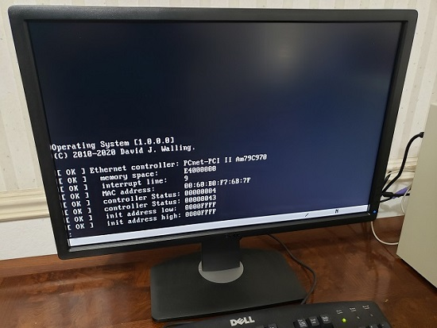</td></tr>
<tr><td>
Output  
- os.dat: A 512-byte boot sector image that may be written to a physical floppy disk for physical implementations. 
- os.dsk: An Emulated 3.5" 1.44MB floppy-disk image for use as a boot disk for either physical or virtual implementations. This disk image contains a boot sector that searches for and loads the os.com kernel image file into memory. Code in os.com places the CPU into protected mode and starts the initial 32-bit console task. 
- os.com: The operating system kernel. 
- osprep.com: A DOS-compatible program that copies the os.dat boot sector image file to the boot sector of a 3.5" 1.44MB floppy disk inserted in logical drive A:.</td><td colspan=2>
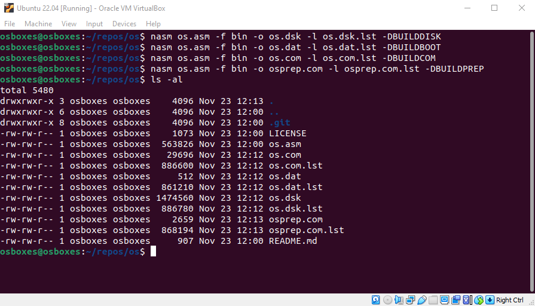
</td></tr>
<tr><td>
Virtualization  
- Set the operating system as "Other/Unknown" 
- Specify 64MB of Base Memory 
- Set the Boot Order to Floppy only 
- The Graphics Controller should be "VBoxVGA"  
- Add a Floppy Controller and set Floppy Device 0: to os.dsk 
- Set the Network Adapter to Pcnet-PCI II
</td><td colspan=2>
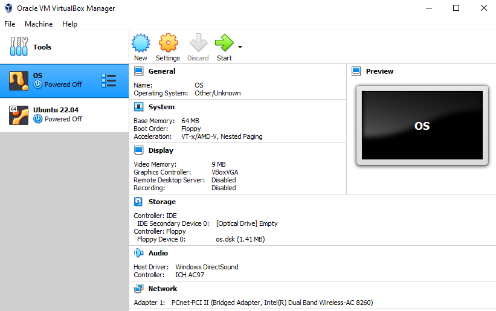
</td></tr>
<tr><td>
Virtualized Operation  
- Start the VM in VirtualBox. 
- The title and version will display. 
- Use the "net" command to confirm network oepration.
</td><td colspan=2>
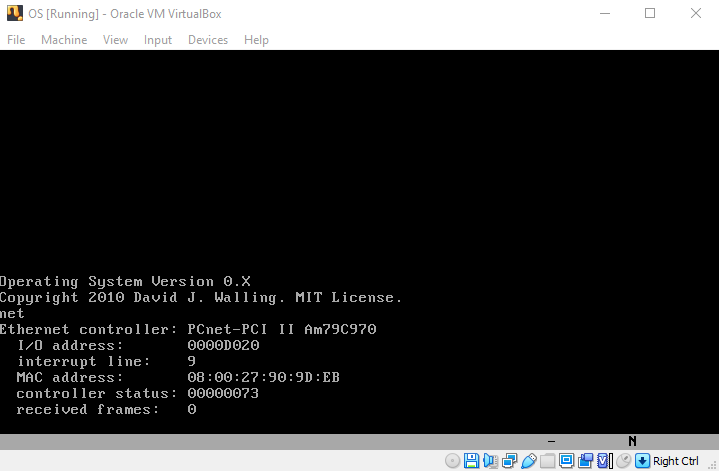
</td></tr>
<tr><td>
Physical Environment  
- The processor is a 233MHz Intel Pentium MMX CPU. 
- The motherboard is a Holco (Shuttle) HOT-555A Rev 3.2 with an Intel 430VX chipset and Award BIOS 1995. 
- This is a "Baby AT" motherboard (230mm x 220mm) requiring AT P8 P9 power connectors.
</td><td>
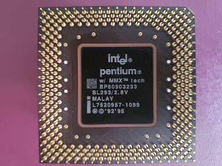
</td><td>
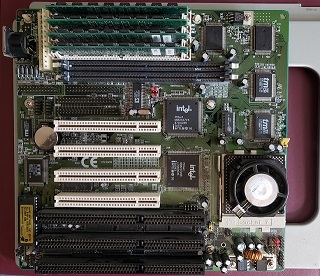
</td></tr>
<tr><td>
- The memory is 64MB of EDO DRAM. 
- The display adapter is a Number Nine 9FX Motion 771 VGA.
</td><td>
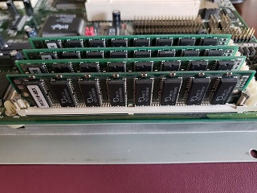
</td><td>
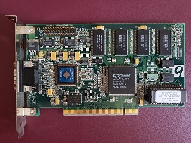
</td></tr>
<tr><td>
- The diskette drive is a Mitsumi D359 M3. 
- The development environment external diskette drive is a Sabrent N533. 
- The diskettes are high-density 3.5" 1.44MB.
</td><td>
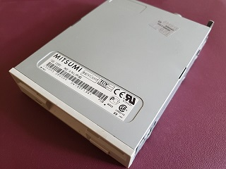
</td><td>
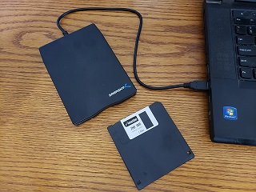
</td></tr>
<tr><td>
- The network adapter is an Advanced Micro Devices PCInet PCI Fast AM79C971. 
- The display monitor is a Dell U2412M. 
- The keyboard is a Dell RT7D20.
</td><td>
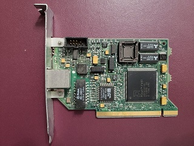
</td><td>

</td></tr>
<tr><td>
Commands  
<table><colgroup><col><col><col></colgroup>
<tr><td>date</td><td>[mm/dd/yyyy]</td><td>display (or set) the date</td></tr>
<tr><td>display d</td><td></td><td>show the display menu</td></tr>
<tr><td>free</td><td>&lt;address&gt;</td><td>free memory at address</td></tr>
<tr><td>lspci p d p</td><td></td><td>display PCI table</td></tr>
<tr><td>m mem d m</td><td>[&lt;address&gt;]</td><td>display memory (at address)</td></tr>
<tr><td>malloc</td><td>&lt;bytes&gt;</td><td>allocate memory</td></tr>
<tr><td>net d n</td><td></td><td>display network information</td></tr>
<tr><td>time</td><td>[hh:mm:ss]</td><td>display (or set) the time</td></tr>
<tr><td>v ver version d v</td><td><td>display program version</td></tr>
</table>
</td><td colspan=2>
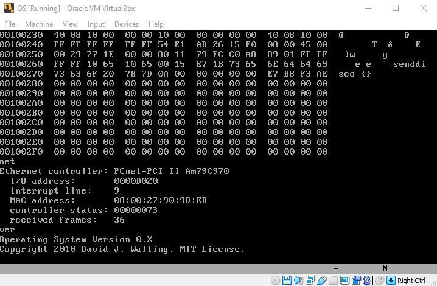
</td></tr>
<tr><td>
Key Memory Addresses  
<table><colgroup><col><col><col><col><col></colgroup>
<tr><td>00000000</td><td colspan=4>Real mode interrupt table</td></tr>
<tr><td>00000400</td><td colspan=4>BIOS variables</td></tr>
<tr><td>00000800</td><td colspan=4>OS variables</td><tr>
<tr><td>00000800</td><td></td><td>Console Heap Memory Address</td></tr>
<tr><td>00000804</td><td></td><td>Console Heap Memory Size</td></tr>
<tr><td>00000808</td><td></td><td>Console Input Buffer</td></tr>
<tr><td>00000859</td><td></td><td>Console Token Buffer</td></tr>
<tr><td>000008AA</td><td></td><td>Console Output Buffer</td></tr>
<tr><td>000008FB</td><td></td><td>Console Column</td></tr>
<tr><td>000008FC</td><td></td><td>Console Row</td></tr>
<tr><td>000008FD</td><td></td><td>Console Keyboard Data</td></tr>
<tr><td>00000907</td><td></td><td>Console Memory Root</td></tr>
<tr><td>0000091F</td><td></td><td>Console Date Time Buffer</td></tr>
<tr><td>00000929</td><td></td><td>Console PCI Context</td></tr>
<tr><td>0000093D</td><td></td><td>Console Ethernet Context</td></tr>
<tr><td>0000097C</td><td></td><td>Console AM79C970 Init Block</td></tr>
<tr><td>00000994</td><td></td><td>ATA Data</td></tr>
<tr><td>00000B94</td><td></td><td>Disk Sector</td></tr>
<tr><td>00000D94</td><td></td><td>Unused</td></tr>
<tr><td>00001000</td><td colspan=4>Global Descriptor Table</td></tr>
<tr><td>00001800</td><td colspan=4>Interrupt Descriptor Table</td></tr>
<tr><td>00002000</td><td colspan=4>Interrupt Handlers and Kernel Library</td></tr>
<tr><td>00004000</td><td colspan=4>Console Stack</td></tr>
<tr><td>00004700</td><td colspan=4>Console Local Descriptor Table</td></tr>
<tr><td>00004780</td><td colspan=4>Console Task State Segment</td></tr>
<tr><td>00004800</td><td colspan=4>Console Message Queue</td></tr>
<tr><td>00005000</td><td colspan=4>Console Code Segment</td></tr>
<tr><td>000A0000</td><td colspan=4>Read Only Memory</td></tr>
<tr><td>00100000</td><td colspan=4>OS Heap</td></tr>
</table>
</td><td colspan=2></td></tr>
</table>
