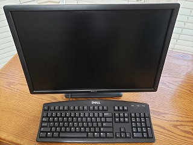

## OS Notes

<table><tr><td>
Intro  
- OS uses the Netwide Assembler (NASM) variant of the Intel Syntax x86 Assembly Language. 
- Examples demonstrate both virtual and physical operating environments. 
- Virtualization uses Oracle &reg; VirtualBox 6.1. 
- Physical operation is demonstrated on an Intel Pentium MMX 233MHz. 
- Networking uses (or emulates) the Am79C971 PCnet &trade;-FAST controller. 
</td><td>

</td></tr></table>

<table>
<colgroup><col style="width:60%;"><col style="width:20%;"><col style="width:20%;"></colgroup>
<tr><td>
Intro  
- OS uses the Netwide Assembler (NASM) variant of the Intel Syntax x86 Assembly Language. 
- Examples demonstrate both virtual and physical operating environments. 
- Virtualization uses Oracle &reg; VirtualBox 6.1. 
- Physical operation is demonstrated on an Intel Pentium MMX 233MHz. 
- Networking uses (or emulates) the Am79C971 PCnet &trade;-FAST controller. 
 
Build  
nasm os.asm -f bin -o os.dsk -l os.dsk.lst -DBUILDDISK 
nasm os.asm -f bin -o os.dat -l os.dat.lst -DBUILDBOOT 
nasm os.asm -f bin -o os.com -l os.com.lst -DBUILDCOM 
nasm os.asm -f bin -o osprep.com -l osprep.com.lst -DBUILDPREP
</td><td colspan=2>

</td></tr>

<tr><td>
Output  
<table>
<tr><td>os.dat</td><td>A 512-byte boot sector image that may be written to a physical floppy disk for physical implementations.</td></tr>
<tr><td>os.dsk</td><td>Emulated 3.5" 1.44MB floppy-disk image for use as a boot disk for either physical or virtual implementations. This disk image contains a boot sector that searches for and loads the os.com kernel image file into memory. Code in os.com places the CPU into protected mode and starts the initial 32-bit console task.</td><tr>
<tr><td>os.com</td><td>The operating system kernel.</td></tr>
<tr><td>osprep.com</td><td>A DOS-compatible program that copies the os.dat boot sector image file to the boot sector of a 3.5" 1.44MB floppy disk inserted in logical drive A:.</td></tr>
</table>
</td><td colspan=2>

</td></tr>

<tr><td>
Virtualization  
- Set the operating system as "Other/Unknown" 
- Specify 64MB of Base Memory 
- Set the Boot Order to Floppy only 
- The Graphics Controller should be "VBoxVGA"  
- Add a Floppy Controller and set Floppy Device 0: to os.dsk 
- Set the Network Adapter to Pcnet-PCI II
</td><td colspan=2>

</td></tr>

<tr><td>
Virtualized Operation  
- Start the VM in VirtualBox. 
- The title and version will display. 
- Use the "net" command to confirm network oepration.
</td><td colspan=2>

</td></tr>

<tr><td>
Physical Environment  
- The processor is a 233MHz Intel Pentium MMX CPU. 
- The motherboard is a Holco (Shuttle) HOT-555A Rev 3.2 with an Intel 430VX chipset and Award BIOS 1995. 
- This is a "Baby AT" motherboard (230mm x 220mm) requiring AT P8 P9 power connectors.
</td><td>

</td><td>

</td></tr>

<tr><td>
- The memory is 64MB of EDO DRAM. 
- The display adapter is a Number Nine 9FX Motion 771 VGA.
</td><td>

</td><td>

</td></tr>

<tr><td>
- The diskette drive is a Mitsumi D359 M3. 
- The development environment external diskette drive is a Sabrent N533. 
- The diskettes are high-density 3.5" 1.44MB.
</td><td>

</td><td>

</td></tr>

<tr><td>
- The network adapter is an Advanced Micro Devices PCInet PCI Fast AM79C971. 
- The display monitor is a Dell U2412M. 
- The keyboard is a Dell RT7D20.
</td><td>

</td><td>

</td></tr>
</table>
