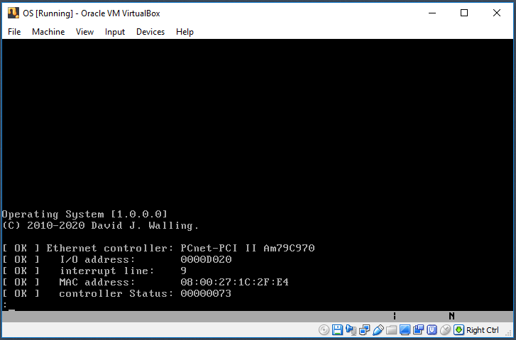
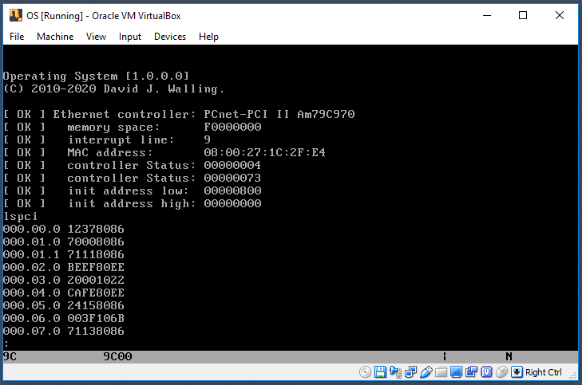
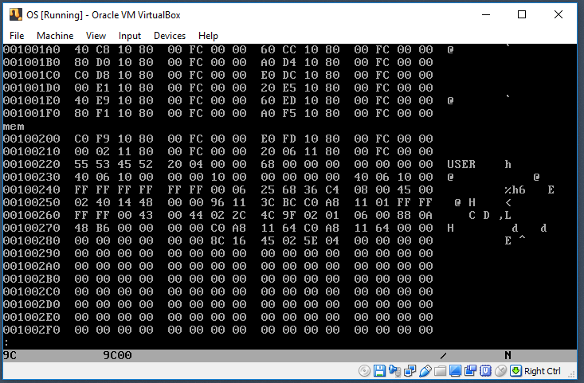

### OS

Copyright (C) 2010-2020 David J. Walling. All rights reserved.

- A simple protected-mode operating system for x86-based PC-compatible systems.
- Operates on 32-bit Intel:registered: or AMD:registered: x86 from the 80386 up through present-day processors.
- Does not require coprocessors or other external firmware or engines beyond the chipset.
- Clear assembly-language, hardware I/O and protocol examples.

### Projects

<table>
<tr><td>001</td><td>A simple boot sector that displays a message</td></tr>
<tr><td>002</td><td>A boot sector that loads and runs a program</td></tr>
<tr><td>003</td><td>Osprep.com writes a boot sector to a diskette</td></tr>
<tr><td>004</td><td>Enter protected mode</td></tr>
<tr><td>005</td><td>Keyboard interrupt</td></tr>
<tr><td>006</td><td>Message queue</td></tr>
<tr><td>007</td><td>CPU interrupt handler</td></tr>
<tr><td>008</td><td>Real-time clock and date/time</td></tr>
<tr><td>009</td><td>Allocate, free and display memory</td></tr>
<tr><td>010</td><td>Probe PCI and read Ethernet frames</td></tr>
</table>

### Assembly

- Samples assembled using NASM (Netwide Asssembler) version 2.14.02.
- make.bat assembles and links on Windows using NASM and ALINK.

### Directives

<table>
<tr><td>BUILDBOOT</td><td>Create os.dat, the operating system boot sector.</td></tr>
<tr><td>BUILDDISK</td><td>Create os.dsk, a 1.44MB 3.5" floppy disk image.</td></tr>
<tr><td>BUILDCOM</td><td>Create os.com, the operating system kernel program.</td></tr>
<tr><td>BUILDPREP</td><td>Create osprep.com, a utility to write the boot sector to a diskette.</td></tr>
</table>

### Output

<table>
<tr><td>os.dat</td><td>A 512-byte boot sector image that may be written to a physical floppy disk for physical implementations.</td></tr>
<tr><td>os.dsk</td><td>A 1.44MB floppy-disk image for use as a boot disk for either physical or virtual implementations. This disk image contains a boot sector that searches for and loads the os.com kernel image file into memory. Code in os.com places the CPU into protected mode and starts the initial 32-bit console task.</td></tr>
<tr><td>os.com</td><td>The operating system kernel image loaded and run by the boot sector. OS.COM can also be run from a DOS command line.</td></tr>
<tr><td>osprep.com</td><td>A DOS-compatible program that copies the os.dat boot sector image file to the boot sector of a 3.5" 1.44MB floppy disk inserted in logical drive A:.</td></tr>
</table>

### Installation

<table>
<tr><td><a href="docs/VIRTUAL.md">Virtual</a></td><td>Configure a virtual machine instance to boot from a floppy drive disk image and select the os.dsk file as the disk image for Floppy Device 0. Select a base memry minimum setting of 4MB or higher.</td></tr>
<tr><td><a href="docs/PHYSICAL.md">Physical</a></td><td>Use a disk editor to copy os.dat to the boot sector of a formatted floppy diskette. Here we use the HxD utility program to do this. Or, use the utility osprep.com to perform this. With the boot sector prepared, copy the os loader program, os.com, to the diskette. Insert the diskette into the target physical system's diskette drive A:. Restart the target physical system.</td></tr>
</table>

### Network Support

- OS includes native support for the AMD:registered: PCInet-PCI FAST AM79C971KC network adapter.
- Virtual machine installations may select this adapter type in the network configuration of the VM.
- Configure this VM network adapter using bridged networking to access the host system's network.

<table><tr>
<td></td>
<td></td>
</tr><tr>
<td></td>
<td></td>
</tr></table>

### Contributors

<table>
<tr><td>David J. Walling</td><td>Email: david@davidjwalling.com</td><td>Twitter: @davidjwalling</td></tr>
</table>
