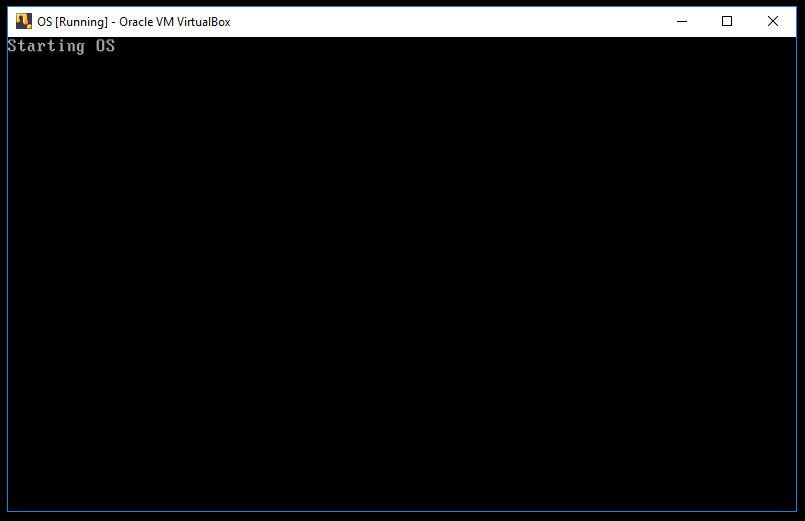
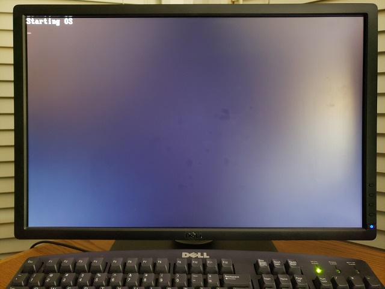
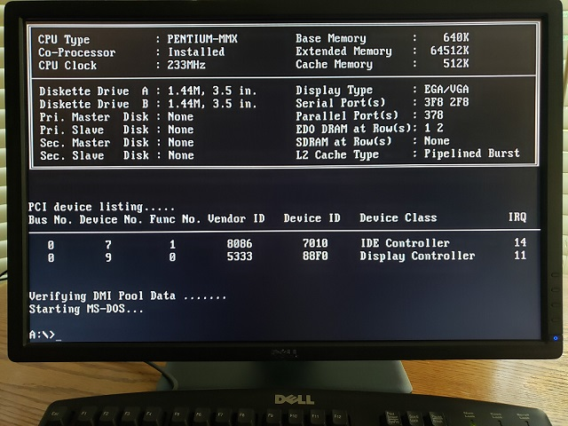
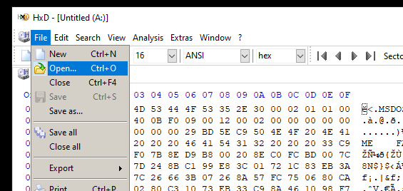
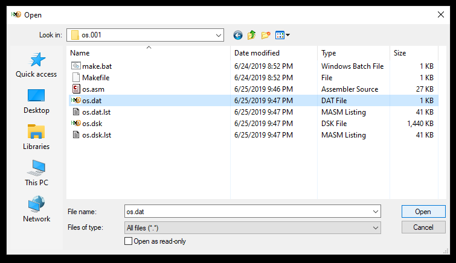

# OS Project os.001
Refer to source file os.001/os.asm.
## Project os.001 Introduces these Features and Topics
- Documentation Elements
- Assembly Directives
- Hardware, Firmware and Software Symbolic Constants (Equates)
- Boot Sector Principles
- CPU, SECTION, BITS Directives
- VSTART Section Parameter
- COM Addressing Model
- Diskette Parameter Table
- Computed Constants
- Basic Input/Output System (BIOS) Interrupts
- STI, HLT, MOV SS Instruction Behavior
## Project os.001 Source-Code Notes
- The program begins with a "flowerbox". That is, a sequence of commented lines with a visible border on, at least, the top and bottom rows and the leftmost column. Omitting a vertical right border avoids excessive padding characters to enforce alignment.
- In these samples, flowerboxes are "major" or "minor". Major flowerboxes use double dashes (or equals signs) for upper and lower borders. Minor flowerboxes uses dashes for upper and lower borders.
- Major flowerboxes begin the program and major code parts. Minor flowerboxes describe code or data immediately following.
- The program flowerbox is a major flowerbox that includes the file name, project name, a description of the program, the date of revision, instructions to assemble the program, the version of the assembler used and a copyright notice.
- Flowerbox contents are column-aligned to improve readability and quick location of information.
- Assembly directives recognized in the source code are describned in a minor flowerbox.
- Directives may cascade, as where defining BUILDDISK will automatically define BUILDBOOT.
- Extensive coding conventions are described in a minor flowerbox. Many conventions support improved readability, such as alignment, naming, and case usage. Other conventions promote efficient operation and maintainability, such as register use, parameter passing and routine entry and exit.
- Program symbolic constants (equates) are defined in a consolidated major part, segmented into hardware, firmware and software domains. Hardware equates include specific devices, such as keyboard controllers. Firmware equates include BIOS constants. Software equates include external standards, such as ASCII, and program-defined values.
- The Boot Sector is the first major code part. This code is loaded by the BIOS from the first sector of the boot disk into RAM at real-mode address 0x7C00. The sector length is 512 bytes. A valid boot sector ends with the two-byte signature, 0xAA 0x55.
- The CPU assembler directive allows the code section to include only code that will execute on an Intel 8086 or compatible processor. The OS should verify the CPU type before attempting to execute instructions reserved to later processors.
- The "boot" section includes a "vstart" parameter instruction the assembler to compose address offsets for labels assuming a 100h displacement from the start of the section. This is compatible with the .COM program model.
- BIOS operations begins in 16-bit real mode. The boot sector, therefore, is written in 16-bit code to accept control directly from the BIOS. The "bits" directive instructs the assembler to generate 16-bit code.
- By convention, a diskette parameter table is located at the start of the boot sector, immediately after a three-byte JMP instruction. This table is used by the BIOS at boot time to define the characteristics of the boot disk.
- Where possible, the code uses computed constants, especially when implementing address offsets or aggregated data. Source lines illustrating constant computation include 246, 282, 353 and 365.
- Note the precautionary use of STI prior to any use of HLT.Note also that a MOV into SS will disable interrupts until the completion of the following instruction which, usually, will allow an uninterrupted setting of SP.
## Project os.001 Operation
### Virtual Machine Operation
- Start a VirtualBox VM configured to boot from os.dsk, emulating a 3.5" 1.44MB floppy diskette.
- The boot (first) sector of the diskette image is loaded to real mode address 0x7C00 and executed.
- The boot sector displays a message, "Starting OS", and waits for a keypress.
- Upon a key press, the system restarts.
### Native Machine Operation
- Prepare a physical 3.5" 1.44MB diskette with os.dat as the boot sector as shown below.
- Insert the prepared diskette into a 3.5" floppy disk drive configured as Drive A:.
- Start the system.
## Project os.001 on Oracle® VM VirtualBox 6.0.10
### Project os.001 running as a virtual machine image.

### Configure VirtualBox's VM system to boot from Floppy first.

### Configure VirtualBox's VM storage to use os.dsk as the inserted disk image for floppy drive device.

## Project os.001 on Target Platform
## Target Platform Components
- Intel® Pentium® MMX 233 MHz Processor Part# BP80503233 (SL293) 2.8V
- Intel® 555A Rev 3.2 Socket 7 Motherboard
- 64MB EDO DRAM
- Mitsumi D359M3 Internal 3.5" 1.44 MB Floppy Drive
- Number Nine #9FX Motion 771 SVGA
- Dell® U2412M 24 inch LCD monitor
- Dell RT7D20 104-Key Standard US Layout Windows Keyboard via PS/2 to 5-pin DIN adapter.
### Project os.001 running natively.

### Intel® Pentium® MMX 233 MHz Processor Part# BP80503233 (SL293) 2.8V

### Intel® 555A Rev 3.2 Socket 7 Motherboard
 

### 64MB EDO DRAM

### Mitsumi D359M3 Internal 3.5" 1.44 MB Floppy Drive
 

### Number Nine #9FX Motion 771 SVGA

### Dell® U2412M 24 inch LCD monitor with Dell RT7D20 104-Key Standard US Layout Windows Keyboard via PS/2 to 5-pin DIN adapter (not shown).

### BIOS Boot to MS-DOS
- We have two installed Mitsumi D359M3 Internal 3.5" 1.44 MB Floppy Drives shown as "A" and "B".
- Here we have booted to MS-DOS installed on a floppy disk in Drive A:.

### Sabrent N533 External Floppy Disk Drive

### Windows Explorer Floppy Disk Properties

### HxD Hex Editor - About

### HxD Hex Editor - Open Device

### HxD Hex Editor - Select Device

### HxD Hex Editor - Read/Write Warning

### HxD Hex Editor - MS-DOS Boot Sector

### HxD Hex Editor - File Open

### HxD Hex Editor - Select os.001/os.dat

### HxD Hex Editor - OS Boot Sector

### HxD Hex Editor - Edit | Copy

### HxD Hex Editor - Edit | Paste Write

### HxD Hex Editor - Overwrite Warning

### HxD Hex Editor - OS Boot Sector Pasted

### HxD Hex Editor - Diskette Changes Saves

### Insert Diskette in Target Platform Floppy Disk Drive and Reboot

