### Project os.002
Source: [os.002/os.asm](../os.002/os.asm)

### Features and Topics
- Reading Diskette Read Sectors usng the BIOS
- FAT-12 and Diskette Directory Organization

### [Virtual](VIRTUAL.md) Machine Operation
- Start a VirtualBox VM configured to boot from os.dsk, emulating a 3.5" 1.44MB floppy diskette following these [steps](VIRTUAL.md).
- The boot (first) sector of the diskette image is loaded to real mode address 0x7C00 and executed.
- The boot sector displays a message, "Loading OS".
- The boot sector then searches the diskette, or image file, for the os.com program.
- If os.com is not found, an error messages is displayed.
- If os.com is found, it is loaded into memory and control is passed to it.
- The os.com program displays a message, "Starting OS".
- Upon a key press, the system restarts.

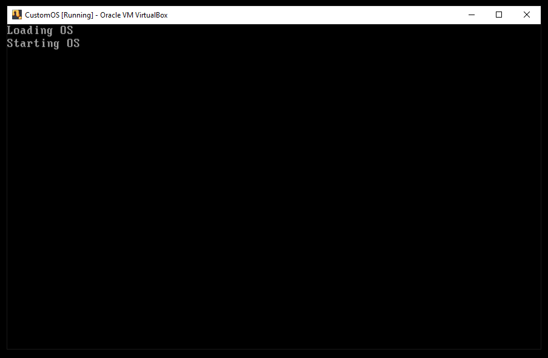

### [Physical](PHYSICAL.md) Machine Operation
- Prepare a physical 3.5" 1.44 MB diskette with os.002/os.dat as the boot sector following steps similar to [these](PHYSICAL.md).
- Note: Copy os.002/os.dat to the diskette boot sector instead of os.001/os.dat.
- Copy os.002/os.com onto the physical diskette.
- Insert the prepared diskette into a 3.5" floppy disk drive configured as Drive A:.
- Start the system.

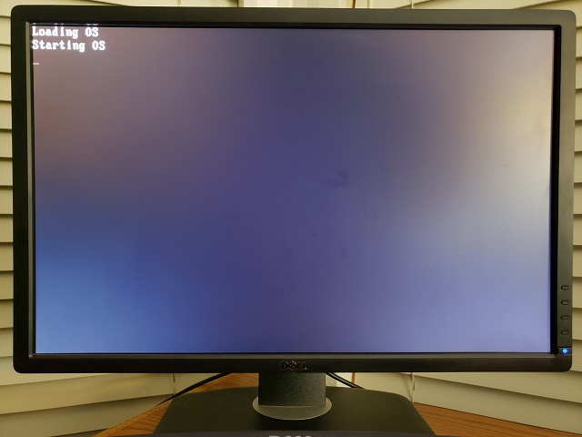

### Notes

The boot sector os.dat is now sufficient to load and run the OS loader program os.com regardless of its size, within reason. From this point on, then, after this project, we do not need to update the physical boot disk sector.

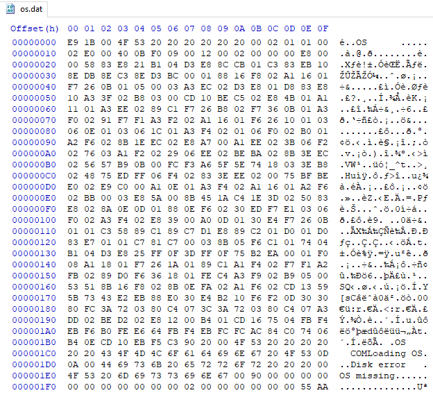

The program introduces the BUILDCOM directive to create the OS kernel program, os.com. BUILDCOM is enabled automatically if the directive BUILDDISK is defined.

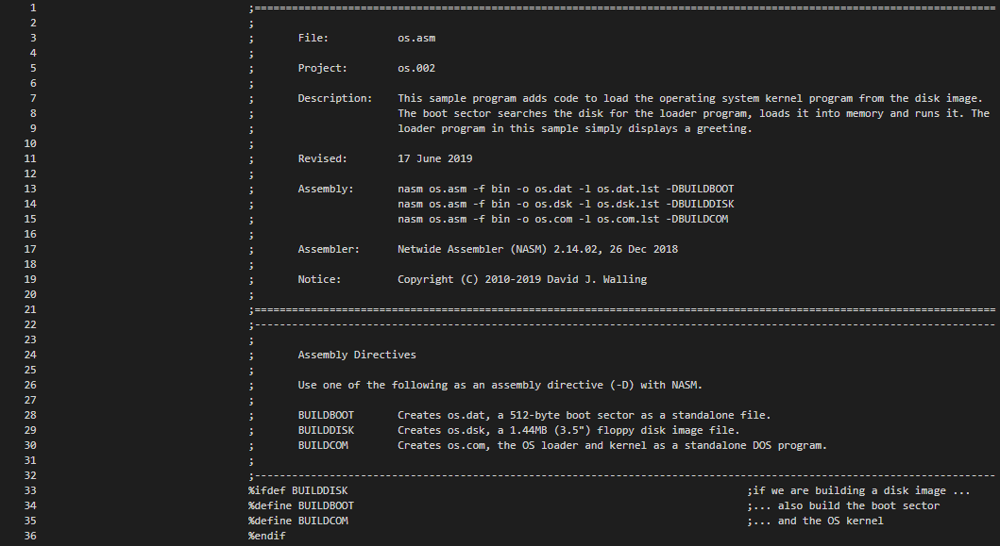

Project os.002 uses the BIOS diskette I/O functions to read the file os.com from the diskette image in virtual environments or from an actual diskette in physical environments.

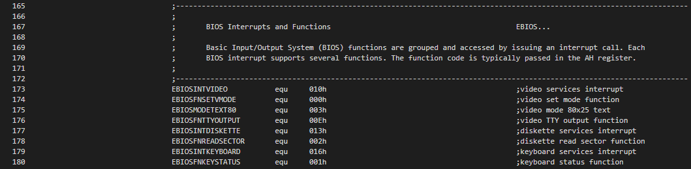

During the loading phase, one copy of the file allocation table and a sector of the diskette directory will be read into memory after the boot sector.

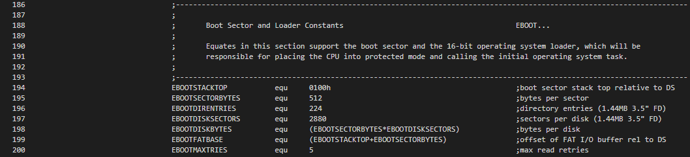

The diskette image file os.dsk is expanded to include the standard two copies of the file allocation table (FAT), the diskette directory and the loader (os.com) program. The boot sector is expanded to search the diskette directory to find, load and run the loader. Each sector of the diskette directory is read and searched until the directory entry for the loader program is found. This entry will identify the starting disk cluster of the loader program and the length of the loader program. The loader program is then loaded into memory and control is transferred to the its code segment. 

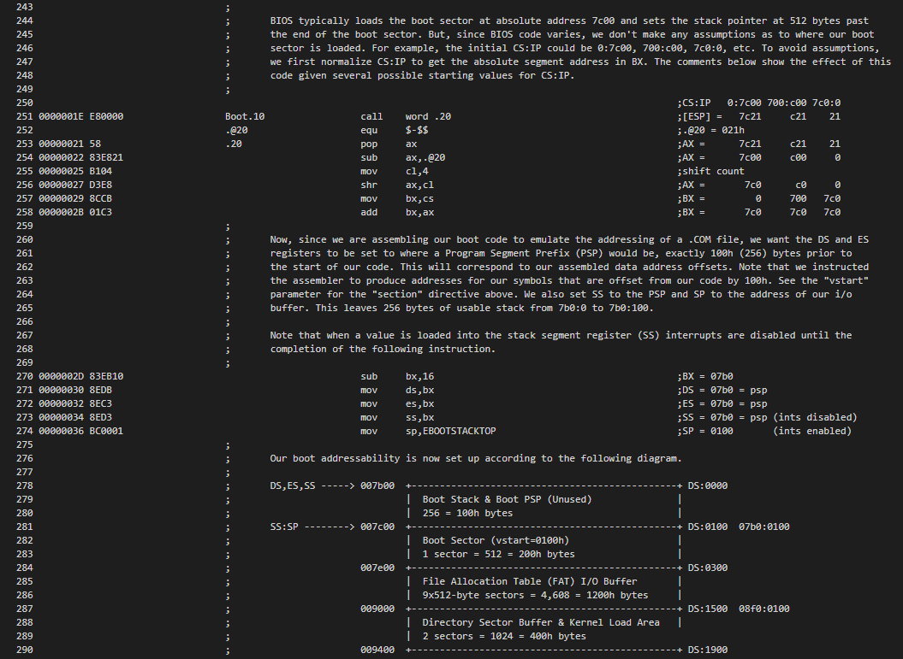

On startup, the DL register indicates the drive that we booted the system from. We save this so that we read FAT, directory and file sectors from the same drive. We compute the segment where the loader program will be loaded so we can perform a far JMP instruction to the loader program. We reset our video mode and display a message, "Loading OS" to indicate our progress thus far. Next we initialize variables used to control our progress searching the directory, loading sectors from the FAT and the loader program, etc.

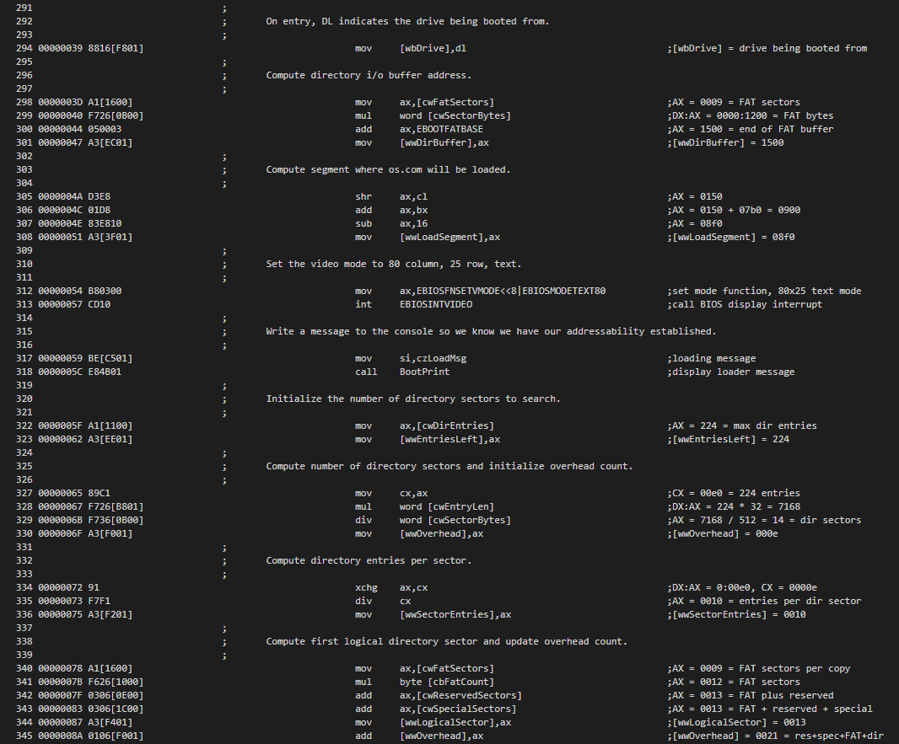

Reading the directory consists of a series of cluster reads into a reusable directory cluster buffer. Each directory cluster contains a series of directory entries searched for the name of the loader program. When the directory entry is found, the size of the loader program and the starting cluster of the program file is taken from the directory entry.

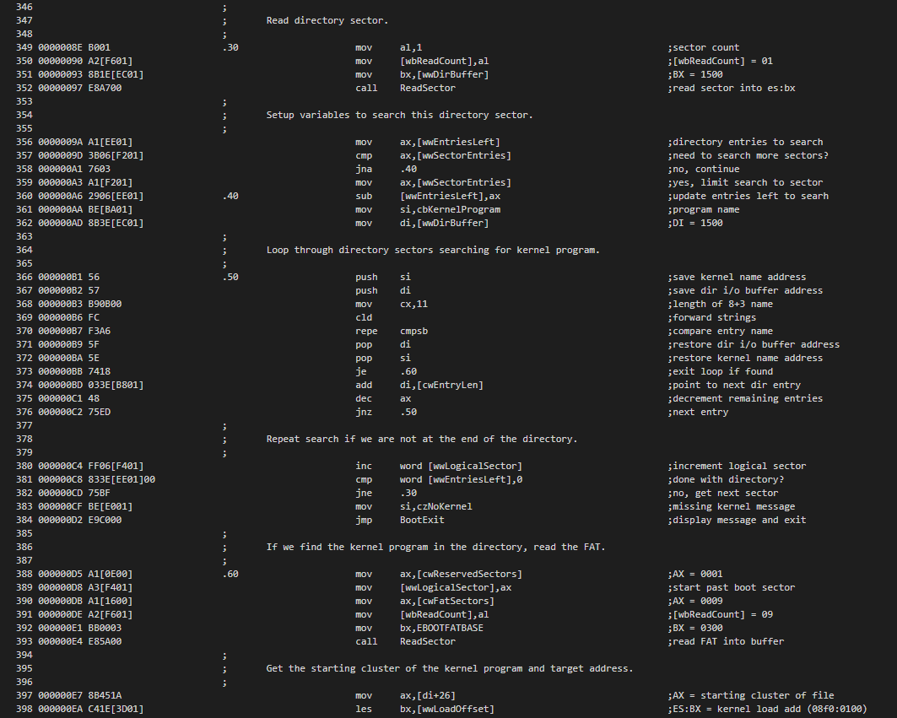

Reading the loader program consists of a series of cluster reads into contiguous memory locations. Here we read the current sector, update the target pointer for the next cluster and compute the next cluster number. This process repeats until we reach the end of the cluster chain in the FAT table for the loader program.

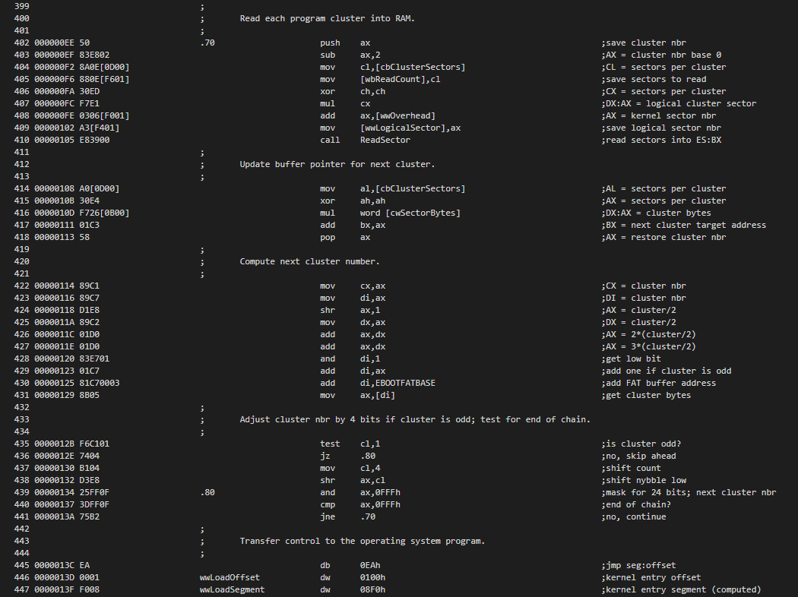

To read the physical sector from the disk, we translate the logical sector number into track, head and physical sector. Each read can be retried. Errors are captured and displayed in a message.

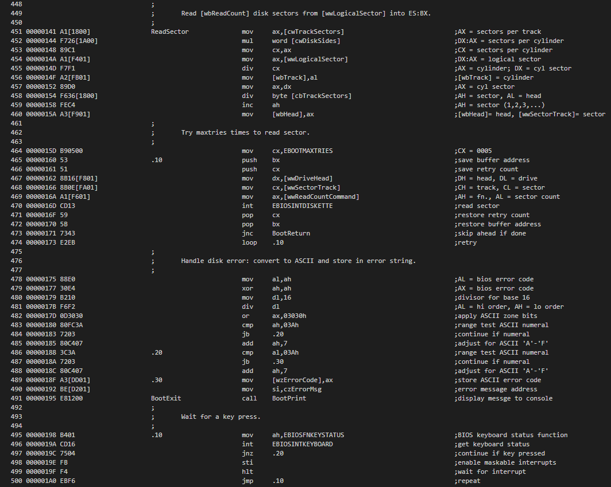

Once a key is pressed the system is reset as was done in project os.001.

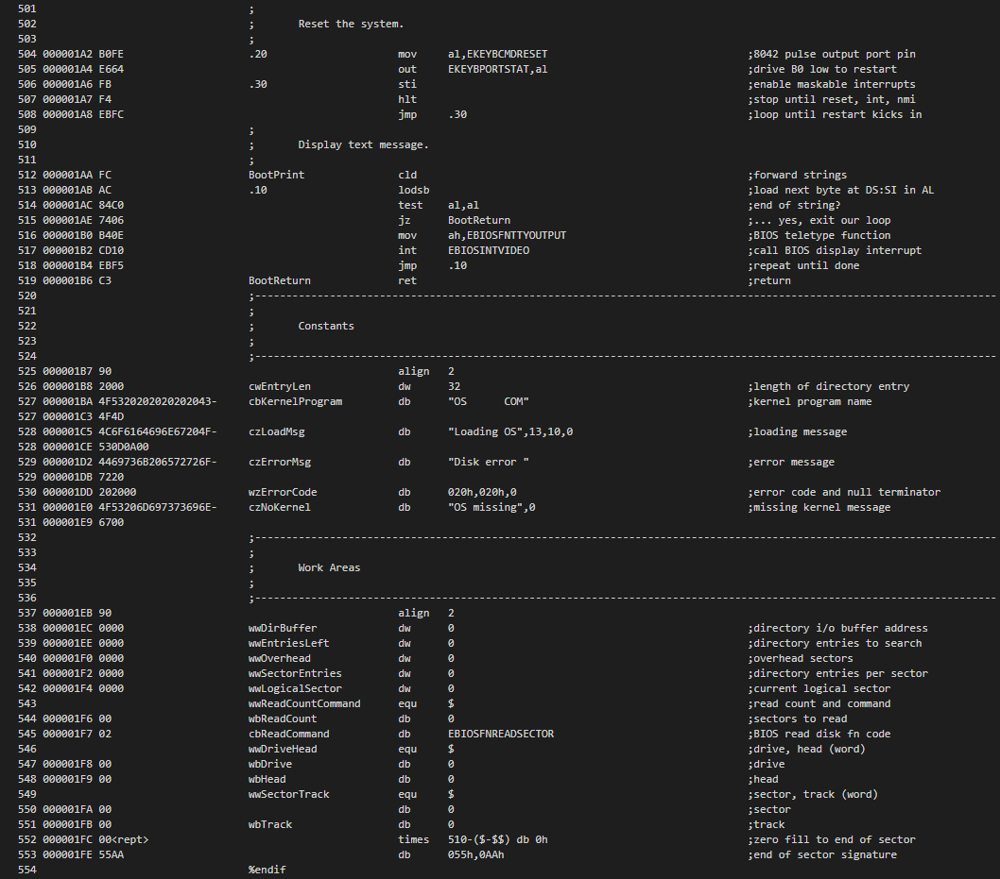

Following the boot sector on disk are two copies of the File Allocation Table (FAT) and the diskette directory. Here there is only one logical "file" on the disk image, the OS loader program, os.com. We have extended the size of the loader code section to 1024 bytes (400h). This is two times the size of a cluster, so we reserve custers 2 and 3 for the loader program. Clusters 0 and 1 are reserved.

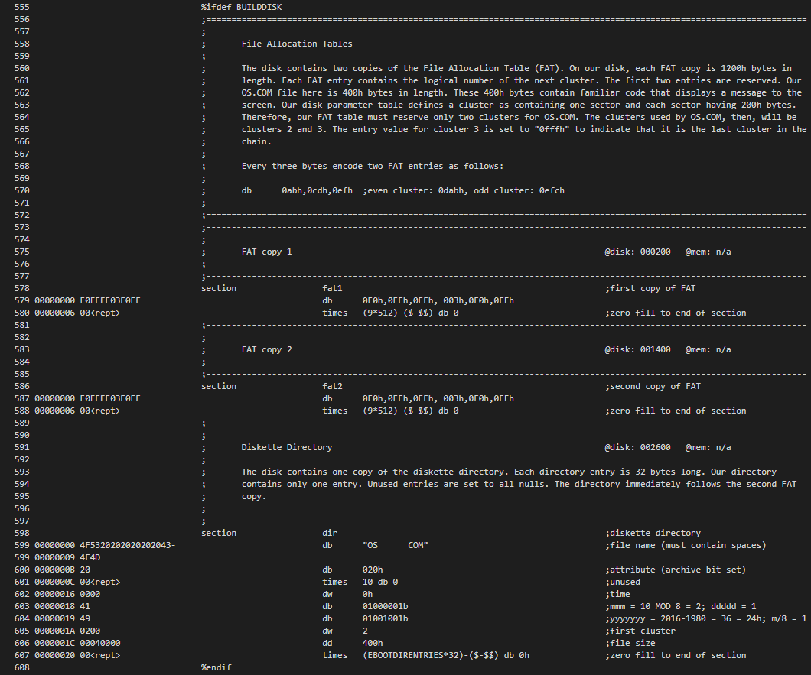

After the os.002/os.com program is loaded into memory from the disk, it resides contiguously at real address 9000h. Since the program addressability is .COM format, we setup the CS, DS and ES segment registers to point to where the typical .COM program segment prefix (PSP) would be located, at 8f0:0 or real address 8f00h. 

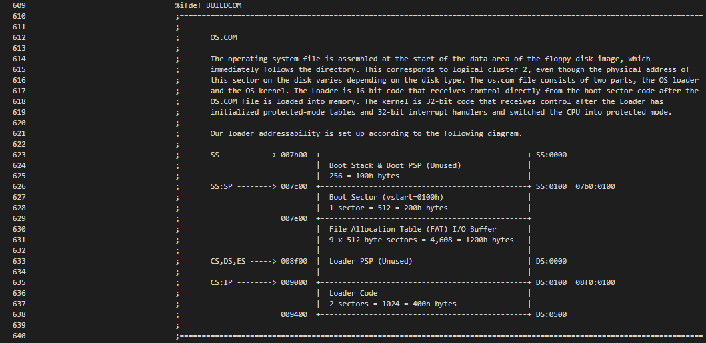

In project os.002, the OS loader is now its own program, os.002/os.com. So here, we begin a new code section, loader, with an address base (vstart) of 100h. This is the code section that corresponds on the disk image to the os.002/os.com program. Since it is loaded and called directly from the boot sector, the loader is also 16-bit code. The program can be run from a DOS environment since its segment addressability is compatible with .COM programs. The loader program here merely displays a message to confirm that the os.002/os.com was successfully found, loaded and run.

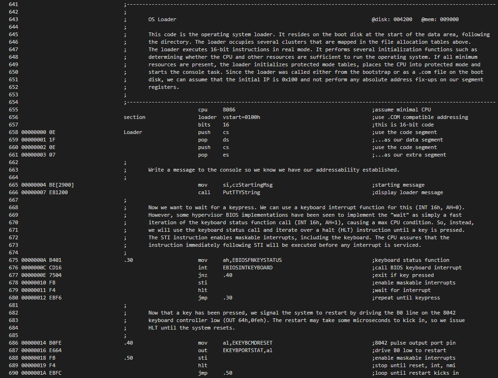

The PutTTYString routine is unchanged from project os.001. No new data elements have been added to the Loader Data section of the code segment. But, the length of the code section has been extended from the original 512 bytes, the size of a disk sector, to 1024, since now the loader is its own file on the disk image and is not limited to the size of a single sector (the boot sector). Also, the loader program, os.002/os.com does not need the end-of-sector mark, 0x55 0xAA.

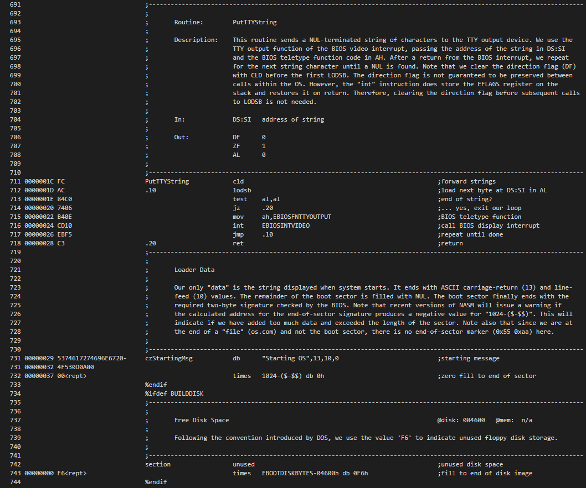
