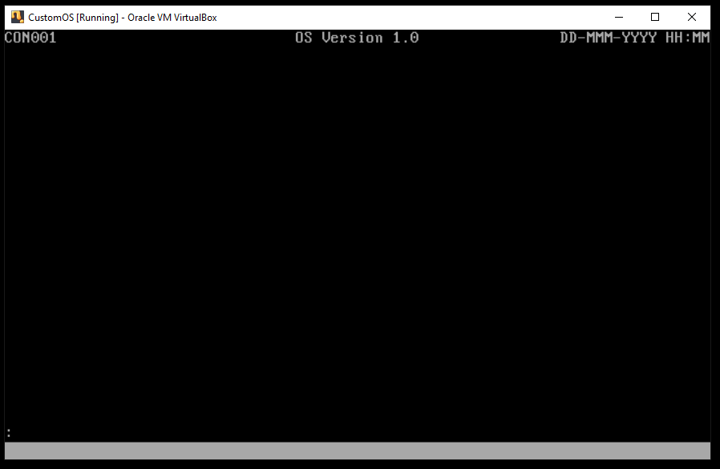

### Project os.005
Source: [os.005/os.asm](../os.005/os.asm)

### Features and Topics
- 6845 Cathode Ray Tube (CRT) I/O
- Software Interrupts
- CGA Cursor Placement
- Defining a Screen or Panel as a Series of Fields

### [Virtual](VIRTUAL.md) Machine Operation
- Update the Virtual Machine configuration to use os.005/os.dsk as the diskette image.
- Start the Virtual Machine.



### [Physical](PHYSICAL.md) Machine Operation
- Overwrite ```os.com``` on the OS boot diskette with os.005/os.com.
- Insert the OS boot diskette into the physical system's floppy disk drive A:.
- Start the system.


### Notes
This project adds code to the console task to add support for "panels". A panel is a set of fields that define text and input elements on the screen. For this project we define one main panel for the console task. The main panel displays a panel identifier, title and placeholder values for the current date and time on the top row, and a command input field preceded by a colon ":" prompt on row 24. The bottom row, row 25, will be reserved for OS indicators. This row is referred to here as the Operator Information Area (OIA).
```
;
;       Hardware-Defined Values
;
;       ECRT...         6845 Cathode Ray Tube (CRT) Controller values
```
Our Equates include two new sections, one for the 6845 Cathode Ray Tube (CRT) I/O constants and one for software constants for the Console Task. We add an ASCII equate for the space character.
```
;-----------------------------------------------------------------------------------------------------------------------
;
;       6845 Cathode Ray Tube (CRT) Controller                                  ECRT...
;
;       The Motorola 6845 CRT Controller (CRTC) is a programmable controller
;       for CGA, EGA, VGA and compatible video modes.
;
;-----------------------------------------------------------------------------------------------------------------------
ECRTPORTHI              equ     003h                                            ;controller port hi
ECRTPORTLO              equ     0D4h                                            ;controller port lo
ECRTCURLOCHI            equ     00Eh                                            ;cursor loc reg hi
ECRTCURLOCLO            equ     00Fh                                            ;cursor loc reg lo
```
```
;-----------------------------------------------------------------------------------------------------------------------
;
;       ASCII                                                                   EASCII...
;
;-----------------------------------------------------------------------------------------------------------------------
EASCIIRETURN            equ     00Dh                                            ;carriage return
EASCIIESCAPE            equ     01Bh                                            ;escape
EASCIISPACE             equ     020h                                            ;space
```
```
;-----------------------------------------------------------------------------------------------------------------------
;       Console Constants                                                       ECON...
;-----------------------------------------------------------------------------------------------------------------------
ECONCOLS                equ     80                                              ;columns per row
ECONROWS                equ     24                                              ;console rows
ECONCOLBYTES            equ     2                                               ;bytes per column
ECONROWBYTES            equ     (ECONCOLS*ECONCOLBYTES)                         ;bytes per row
ECONROWDWORDS           equ     (ECONROWBYTES/4)                                ;double-words per row
ECONCLEARDWORD          equ     007200720h                                      ;attribute and ASCII space
ECONOIADWORD            equ     070207020h                                      ;attribute and ASCII space
```
We also add a constant to reference the Color Graphics Adapter (CGA) video memory area in the Global Descriptor Table (GDT).
```
;-----------------------------------------------------------------------------------------------------------------------
;       Global Descriptor Table (GDT) Selectors                                 EGDT...
;-----------------------------------------------------------------------------------------------------------------------
EGDTOSDATA              equ     018h                                            ;kernel data selector
EGDTCGA                 equ     020h                                            ;cga video selector
```
At the end of the data structure, defined in that last project, for the low-memory BIOS area, we now begin to declare address locations to store console task variables.
```
;-----------------------------------------------------------------------------------------------------------------------
;
;       Kernel Variables                                                        @disk: N/A      @mem: 000800
;
;       Kernel variables may be accessed by interrupts or by the initial task (Console).
;
;-----------------------------------------------------------------------------------------------------------------------
ECONDATA                equ     ($)
                                                                                ;---------------------------------------
                                                                                ;  panel handling
                                                                                ;---------------------------------------
wdConsolePanel          resd    1                                               ;panel definition addr
wdConsoleField          resd    1                                               ;active field definition addr
wzConsoleInBuffer       resb    80                                              ;command input buffer
                                                                                ;---------------------------------------
                                                                                ;  cursor placement
                                                                                ;---------------------------------------
wbConsoleColumn         resb    1                                               ;console column
wbConsoleRow            resb    1                                               ;console row
ECONDATALEN             equ     ($-ECONDATA)                                    ;size of console data area
;-----------------------------------------------------------------------------------------------------------------------
;
;       End of OS Variables
;
;-----------------------------------------------------------------------------------------------------------------------
```
Starting with this project, we introduce Interrupt 30h as a single entry point for several OS kernel-level functions usable by any task. First we define the tsvce macro, which will be used to define a table entry. Each table entry will be given an address label and a service number which will translate into an index offset into the service table. The service table entry values themselves are the addresses of the routine entry points in the OS kernel code segment.
```
%macro                  tsvce   1
e%1                     equ     ($-tsvc)/4
                        dd      %1
%endmacro
```
Next we add an entry in the Interrupt Descriptor Table (IDT) for interrupt 30h. We use an mtrap macro for this descriptor. It references a label "svc" that we'll define next.
```
                        mtrap   svc                                             ;30 OS services
```
Now we define three more sections. First we use the "menter" macro to define an Interrupt Handler entry point named "svc", to correspond to our interrupt descriptor table entry defined above. The "svc" entry point checks the interrupt number passed as an argument in AL. If the interrupt number is within a valid range, it is converted to an index offset into the a service request table of service routine addresses. Then, control is passed to the address stored in the table.
```
;-----------------------------------------------------------------------------------------------------------------------
;
;       INT 30h Operating System Software Service Interrupt
;
;       Interrupt 30h is used by our operating system as an entry point for many commonly-used subroutines reusable by
;       any task. These routines include low-level i/o functions that shield applications from having to handle
;       device-specific communications. On entry to this interrupt, AL contains a function number that is used to load
;       the entry address of the specific function from a table.
;
;-----------------------------------------------------------------------------------------------------------------------
                        menter  svc
                        cmp     al,maxtsvc                                      ;is our function out of range?
                        jae     svc90                                           ;yes, skip ahead
                        movzx   eax,al                                          ;function
                        shl     eax,2                                           ;offset into table
                        call    dword [cs:tsvc+eax]                             ;far call to indirect address
svc90                   iretd                                                   ;return from interrupt
```
The Servce Request Table, "tsvc", will consist of a sequence of "tsvce" macros define above. Here we add one entry to the Service Request Table, for the new routine, PlaceCursor. Note that the "maxtsvc" value checked by "svc" is dynamically generated at the end of the "tsvc" table.
```
;-----------------------------------------------------------------------------------------------------------------------
;
;       Service Request Table
;
;
;       These tsvce macros expand to define an address vector table for the service request interrupt (int 30h).
;
;-----------------------------------------------------------------------------------------------------------------------
tsvc                    tsvce   PlaceCursor                                     ;place the cursor at the current loc
maxtsvc                 equ     ($-tsvc)/4                                      ;function out of range
```
Next, we define a macro, placeCursor, placeCursor for our new PlaceCursor routine. The macro is used in our task code to invoke a "int" instruction to the interrupt service handler "svc" (030h). The macro allows us to prepare registers with values expected by the interrupt service routine. In this case, we put the service routine number (ePlaceCursor), which is computed by the "tscve" macro, into register AL and invoke interrupt _svc (030h).
```
;-----------------------------------------------------------------------------------------------------------------------
;
;       Service Request Macros
;
;       These macros provide positional parameterization of service request calls.
;
;-----------------------------------------------------------------------------------------------------------------------
%macro                  placeCursor 0
                        mov     al,ePlaceCursor                                 ;function code
                        int     _svc                                            ;invoke OS service
%endmacro
```
Finally, we add the code for PlaceCursor itself. This routine uses the 6845 CRT controller I/O ports to place the cursor on the screen using row and column coordinates stored in two of our console task variables.
```
;=======================================================================================================================
;
;       Kernel Function Library
;
;=======================================================================================================================
;=======================================================================================================================
;
;       Input/Output Routines
;
;       These routines read and/or write directly to ports.
;
;       PlaceCursor
;       PutPrimaryEndOfInt
;       PutSecondaryEndOfInt
;
;=======================================================================================================================
;-----------------------------------------------------------------------------------------------------------------------
;
;       Routine:        PlaceCursor
;
;       Description:    This routine positions the cursor on the console.
;
;       In:             DS      OS data selector
;
;-----------------------------------------------------------------------------------------------------------------------
PlaceCursor             push    ecx                                             ;save non-volatile regs
                        mov     al,[wbConsoleRow]                               ;AL = row
                        mov     ah,ECONCOLS                                     ;AH = cols/row
                        mul     ah                                              ;row offset
                        add     al,[wbConsoleColumn]                            ;add column
                        adc     ah,0                                            ;add overflow
                        mov     ecx,eax                                         ;screen offset
                        mov     dl,ECRTPORTLO                                   ;crt controller port lo
                        mov     dh,ECRTPORTHI                                   ;crt controller port hi
                        mov     al,ECRTCURLOCHI                                 ;crt cursor loc reg hi
                        out     dx,al                                           ;select register
                        inc     edx                                             ;data port
                        mov     al,ch                                           ;hi-order cursor loc
                        out     dx,al                                           ;store hi-order loc
                        dec     edx                                             ;register select port
                        mov     al,ECRTCURLOCLO                                 ;crt cursor loc reg lo
                        out     dx,al                                           ;select register
                        inc     edx                                             ;data port
                        mov     al,cl                                           ;lo-order cursor loc
                        out     dx,al                                           ;store lo-order loc
                        pop     ecx                                             ;restore non-volatile regs
                        ret                                                     ;return
```
Now in our console task, we have four discrete steps. First we initialize our console work areas using a store repetition. Secondly, we initialize the Operator Information Area by addressing the video memory directly using the "EGDTCGA" symbolic we created to reference the video memory descriptor in the GDT. Third, we call a routine, ConMain, to initialize console task variables to use a "panel" to display fields on the screen. Lastly, we call a routine "ConPutCursor" to position the cursor at the current location in the active panel field.
```
;=======================================================================================================================
;
;       Console Task Routines
;
;       ConCode                 Console task entry point
;       ConClearPanel           Clear the panel area of video memory to spaces
;       ConDrawFields           Draw the panel fields to video memory
;       ConDrawField            Draw a panel field to video memory
;       ConPutCursor            Place the cursor at the current index into the current field
;       ConMain                 Handle the main command
;
;=======================================================================================================================
section                 concode vstart=05000h                                   ;labels relative to 5000h
;
;       Initialize console work areas to low values.
;
ConCode                 mov     edi,ECONDATA                                    ;OS console data address
                        xor     al,al                                           ;initialization value
                        mov     ecx,ECONDATALEN                                 ;size of OS console data
                        cld                                                     ;forward strings
                        rep     stosb                                           ;initialize data
;
;       Initialize the Operator Information Area (OIA).
;
                        push    es                                              ;save extra segment
                        push    EGDTCGA                                         ;load CGA video selector...
                        pop     es                                              ;...into extra segment reg
                        mov     edi,ECONROWS*ECONROWBYTES                       ;target offset
                        mov     eax,ECONOIADWORD                                ;OIA attribute and space
                        mov     ecx,ECONROWDWORDS                               ;double-words per row
                        rep     stosd                                           ;reset OIA
                        pop     es                                              ;restore extra segment
;
;       Set the current panel to Main, clear and redraw all fields.
;
                        call    ConMain                                         ;initialize panel
;
;       Place the cursor at the current field index.
;
                        call    ConPutCursor                                    ;place the cursor
;
;       Enter halt loop
;
.10                     sti                                                     ;enable interrupts
                        hlt                                                     ;halt until interrupt
                        jmp     .10                                             ;continue halt loop
```
The ConMain routine makes use of two routines we see next. ConClearPanel clears the CGA video memory used by panels, the first 24 rows. ConDrawFields steps through the panel definition and draws each field in the panel on the screen. The current active input field is chosen as the first input field found if no active input field is already defined.
```
;-----------------------------------------------------------------------------------------------------------------------
;
;       Routine:        ConClearPanel
;
;       Description:    This routine clears the console panel video memory. The panel field buffer values
;                       are not disturbed.
;
;-----------------------------------------------------------------------------------------------------------------------
ConClearPanel           push    ecx                                             ;save non-volatile regs
                        push    edi                                             ;
                        push    es                                              ;
;
;       Clear panel rows.
;
                        push    EGDTCGA                                         ;load CGA video selector...
                        pop     es                                              ;...into extra segment reg
                        xor     edi,edi                                         ;target offset
                        mov     eax,ECONCLEARDWORD                              ;initialization value
                        mov     ecx,ECONROWS*ECONROWDWORDS                      ;double-words to clear
                        cld                                                     ;forward strings
                        rep     stosd                                           ;reset screen body
;
;       Restore and return.
;
                        pop     es                                              ;restore non-volatile regs
                        pop     edi                                             ;
                        pop     ecx                                             ;
                        ret                                                     ;return
```
```
;-----------------------------------------------------------------------------------------------------------------------
;
;       Routine:        ConDrawFields
;
;       Description:    This routine draws the panel fields. If there is no active input field, the first input
;                       field of the panel is set as the active field.
;
;-----------------------------------------------------------------------------------------------------------------------
ConDrawFields           push    ebx                                             ;save non-volatile regs
;
;       Exit if no panel
;
                        mov     ebx,[wdConsolePanel]                            ;panel definition addr
                        test    ebx,ebx                                         ;have panel?
                        jz      .30                                             ;no, branch
;
;       Loop until end of panel
;
.10                     cmp     dword [ebx],0                                   ;end of panel?
                        je      .30                                             ;yes, branch
;
;       If input field and we have no active field, set as active field
;
                        test    byte [ebx+11],80h                               ;input field?
                        jz      .20                                             ;no, branch
                        cmp     dword [wdConsoleField],0                        ;have active field?
                        jne     .20                                             ;yes, branch
                        mov     [wdConsoleField],ebx                            ;set active field
;
;       Draw the field and loop to the next field.
;
.20                     call    ConDrawField                                    ;draw field
                        lea     ebx,[ebx+12]                                    ;next field addr
                        jmp     .10                                             ;next field
;
;       Restore and return.
;
.30                     pop     ebx                                             ;restore non-volatile regs
                        ret                                                     ;return
```
The process of drawing the field, for this project, is limited to locating the field's offset address on the screen and drawing the character and attribute for each column position, then filling any remaining screen colums for the field with spaces. In a future project we will add highlighting the current selected text in the input field.
```
;-----------------------------------------------------------------------------------------------------------------------
;
;       Routine:        ConDrawField
;
;       Description:    This routine draws the contents of a panel field.
;
;       In:             DS:EBX  field definition address
;                               [ebx+0]         field buffer address
;                               [ebx+4]         row (0-23)
;                               [ebx+5]         column (0,79)
;                               [ebx+6]         size (0-255)
;                               [ebx+7]         cursor index (0-255)
;                               [ebx+8]         1st selected index (0-255)
;                               [ebx+9]         last selected index (0-255)
;                               [ebx+10]        attribute
;                               [ebx+11]        flags
;                                               80h = input field
;
;-----------------------------------------------------------------------------------------------------------------------
ConDrawField            push    ecx                                             ;save non-volatile regs
                        push    esi                                             ;
                        push    edi                                             ;
                        push    es                                              ;
;
;       Exit if no field or zero size.
;
                        test    ebx,ebx                                         ;have field?
                        jz      .30                                             ;no, exit
                        movzx   ecx,byte [ebx+6]                                ;have size?
                        jecxz   .30                                             ;no, exit
;
;       Address video memory.
;
                        push    EGDTCGA                                         ;load CGA video selector...
                        pop     es                                              ;...into extra segment reg
;
;       Compute the target offset.
;
                        movzx   eax,byte [ebx+4]                                ;row
                        mov     ah,ECONCOLS                                     ;columns per row
                        mul     ah                                              ;row offset
                        add     al,byte [ebx+5]                                 ;add column
                        adc     ah,0                                            ;handle overflow
                        shl     eax,1                                           ;two-bytes per column
                        mov     edi,eax                                         ;target offset
;
;       Display field characters.
;
                        mov     ah,[ebx+10]                                     ;attribute
                        cld                                                     ;forward strings
                        mov     esi,[ebx]                                       ;field buffer addr
                        test    esi,esi                                         ;have field buffer?
                        jz      .20                                             ;no, exit
.10                     lodsb                                                   ;field character
                        test    al,al                                           ;end of value?
                        jz      .20                                             ;yes, branch
                        stosw                                                   ;store character with attribute
                        dec     ecx                                             ;decrement remaining size
                        jecxz   .30                                             ;exit if field full
                        jmp     .10                                             ;next character
;
;       Clear the remaining field.
;
.20                     mov     al,EASCIISPACE                                  ;ASCII space
                        rep     stosw                                           ;store space with attribute
;
;       Restore and return.
;
.30                     pop     es                                              ;restore non-volatile regs
                        pop     edi                                             ;
                        pop     esi                                             ;
                        pop     ecx                                             ;
                        ret                                                     ;return
```
The ConPutCursor routine takes the row and column attributes of the current active field to update the console cursor row and column position. The column is updated to reflect the current offset into the field. The ConMain routine sets the current console panel and active field values, then calls routines to clear the panel and draw the panel fields.
```
;-----------------------------------------------------------------------------------------------------------------------
;
;       Routine:        ConPutCursor
;
;       Description:    This routine places the cursor at the current index into the current field.
;
;-----------------------------------------------------------------------------------------------------------------------
ConPutCursor            push    ecx                                             ;save non-volatile regs
                        mov     ecx,[wdConsoleField]                            ;current field?
                        jecxz   .10                                             ;no, branch
                        mov     al,[ecx+4]                                      ;field row
                        mov     [wbConsoleRow],al                               ;set current row
                        mov     al,[ecx+5]                                      ;field column
                        add     al,[ecx+7]                                      ;field offset
                        mov     [wbConsoleColumn],al                            ;set curren tcol
                        placeCursor                                             ;place the cursor
.10                     pop     ecx                                             ;restore non-volatile regs
                        ret                                                     ;return
```
```
;-----------------------------------------------------------------------------------------------------------------------
;
;       Routine:        ConMain
;
;       Description:    This routine sets the current panel to the main panel (CON001).
;
;       In:             ES:     OS data segment
;
;-----------------------------------------------------------------------------------------------------------------------
ConMain                 push    ecx                                             ;save non-volatile regs
                        push    edi                                             ;
;
;       Initialize current panel, field.
;
                        mov     eax,czPnlCon001                                 ;main panel addr
                        mov     [wdConsolePanel],eax                            ;set panel addr
                        mov     eax,czPnlConInp                                 ;main panel command field addr
                        mov     [wdConsoleField],eax                            ;set active field
;
;       Clear panel video memory and draw fields
;
                        call    ConClearPanel                                   ;clear panel
                        call    ConDrawFields                                   ;draw fields
;
;       Restore and return.
;
                        pop     edi                                             ;restore non-volatile regs
                        pop     ecx                                             ;
                        ret                                                     ;return
```
This project defines one panel. In a "Constants" section, we provide the panel definition. Each field in the panel consists of a reference to either a constant null-terminated string or an input field. Then, each field has attributes indicating the field row and column, size, current index, the first and last "selected" column, the column attribute (background color/blink setting) and a flags field where the high-order bit set indicates an input field. Following the panel definition are the constant strings used in the panel.
```
;-----------------------------------------------------------------------------------------------------------------------
;
;       Constants
;
;-----------------------------------------------------------------------------------------------------------------------
;-----------------------------------------------------------------------------------------------------------------------
;
;       Panels
;
;       Notes:          1.      Each field MUST have an address of a constant or an input field.
;                       2.      The constant text or input field MUST be at least the length of the field.
;                       3.      Field constant text or field values MUST be comprised of printable characters.
;
;-----------------------------------------------------------------------------------------------------------------------
                                                                                ;---------------------------------------
                                                                                ;  Main Panel
                                                                                ;---------------------------------------
czPnlCon001             dd      czFldPnlIdCon001                                ;field text
                        db      0,0,6,0,0,0,7,0                                 ;row col siz ndx 1st nth atr flg
                        dd      czFldTitleCon001
                        db      0,33,14,0,0,0,7,0
                        dd      czFldDatTmCon001
                        db      0,63,17,0,0,0,7,0
                        dd      czFldPrmptCon001
                        db      23,0,1,0,0,0,7,0
czPnlConInp             dd      wzConsoleInBuffer
                        db      23,1,79,0,0,0,7,80h
                        dd      0                                               ;end of panel
;-----------------------------------------------------------------------------------------------------------------------
;
;       Strings
;
;-----------------------------------------------------------------------------------------------------------------------
czFldPnlIdCon001        db      "CON001",0                                      ;main console panel id
czFldTitleCon001        db      "OS Version 1.0",0                              ;main console panel title
czFldDatTmCon001        db      "DD-MMM-YYYY HH:MM",0                           ;panel date and time template
czFldPrmptCon001        db      ":",0                                           ;command prompt
```
