### Project os.006
Source: [os.006/os.asm](../os.006/os.asm)

### Features and Topics
- Keyboard Controller I/O
- Keyboard Scan Code to ASCII translation

### [Virtual](VIRTUAL.md) Machine Operation
- Update the Virtual Machine configuration to use os.006/os.dsk as the diskette image.
- Start the Virtual Machine.

### [Physical](PHYSICAL.md) Machine Operation
- Overwrite os.com on the OS boot diskette with os.006/os.com.
- Insert the OS boot diskette into the physical system's floppy disk drive A:.
- Start the system.

### Notes

This project adds code for the Keyboard Interrupt handler (IRQ1). The interrupt handler reads scan codes from the 8042 keyboard controller and updates shift and key lock states. If the scan code translates into an printable ASCII scan code this is represented in the Operator Information Area (OIA).

In our Equates section, we add a new section for keyboard flags EKEYF...

The existing section for keyboard codes is expanded to define specific keyboard scan codes used in the keyboard interrupt.

The ASCII codes section is expanded to add additional ASCII codes checked in the keyboard interrupt.

The OS tracks the state of shift and lock keys using flags in a console task storage word.

We define a KEYBDATA structure to group together the set of storage areas used to maintain the state of the keyboard.

In our kernel data area we define an instance of the KEYBDATA structure, called wsKeybData.

The keyboard interrupt starts by sending the end-of-interrupt signal to the PIC, resetting working areas, reading the first scan code. If the "e1" extended code is arrived, we want to take two additional scan codes for evaluation.

A keyboard read timeout should not normally occur, but we'll set a status bit if it does happen. The "e0" extended code requires we take one additional scan code. The Print Screen keyboard sends both the make and break code sequences immediately.

We use an OS-specific extended scan code table so that we return ONE scan code for key press or release. Some codes here will affect shift or lock key status flags.

Single-byte scan codes may also update shift or lock flags. The remaining used to look-up corresponding ASCII base or shifted values.

The case of the ASCII code may be affected by the state of the caps-lock and shift keys. Also, if NUM-LOCK is on, if may affect the codes returned by keys in the numeric key-pad. Once the final scan code and ASCII character, if any, is determined, we update the Operator Information Area (OIA). In a later project we will pass these codes to the active task using a message queue.

The translation tables used by they keyboard interrupt follow. These handle numeric key-pad, scan code to extended scan code, scan to ASCII base and scan to ASCII shifted.

 

In this project, we add three new kernel routines accessed through the interrupt 30h service handler. PutConsoleOIA writes updated status indicators to the screen. SetKeyboardLamps turns on or off the keyboard light-emiting diodes (LED) that indicate caps-lock, num-lock and scroll-lock. The Yield routine issues a HLT to allow another task to run if needed.

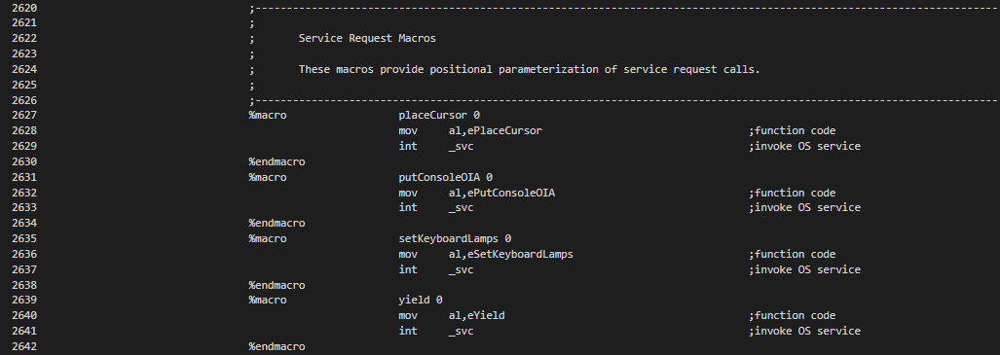

In the kernel routine library, the above-mentioned three routines along with several other helper routines are added. The first, PutConsoleHexByte writes a given ASCII character to the screen at the given coordinates.

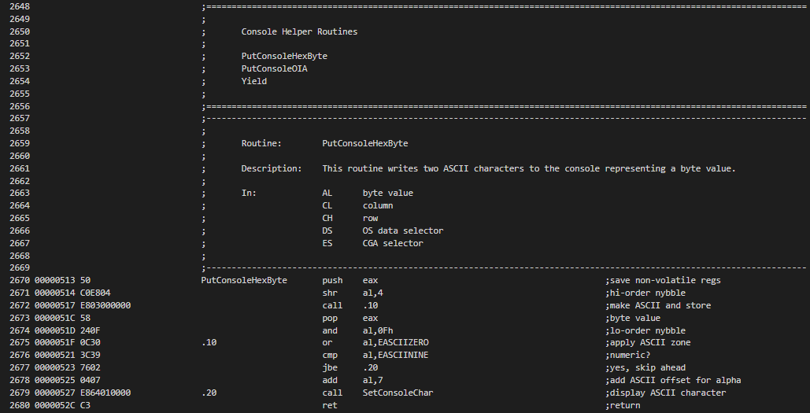

The PutConsoleOIA routine draws indicators, characters and numbers, to the CGA screen on the OIA row to indicate the status of shift and lock keys, the scan codes read from the 8042 keyboard controller, and the final extended scan code and corresponding ASCII code. Also shown, if applicable, is any printable ASCII character corresponding to the ASCII code.

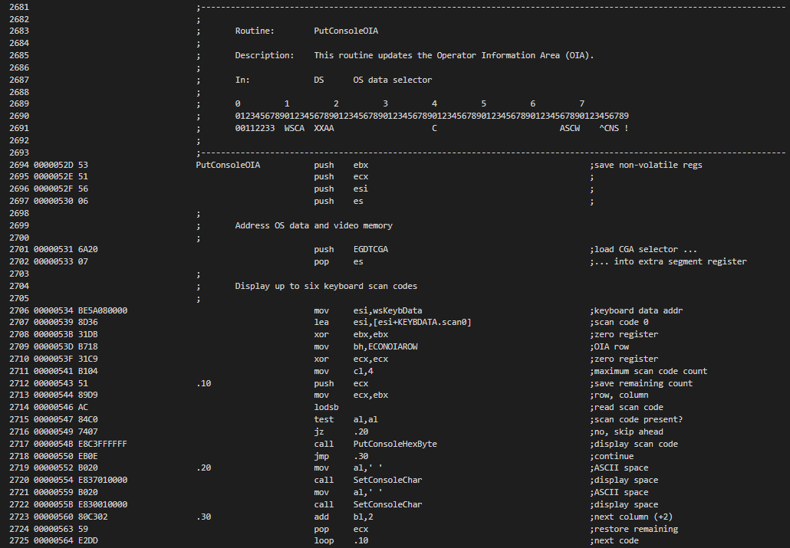 
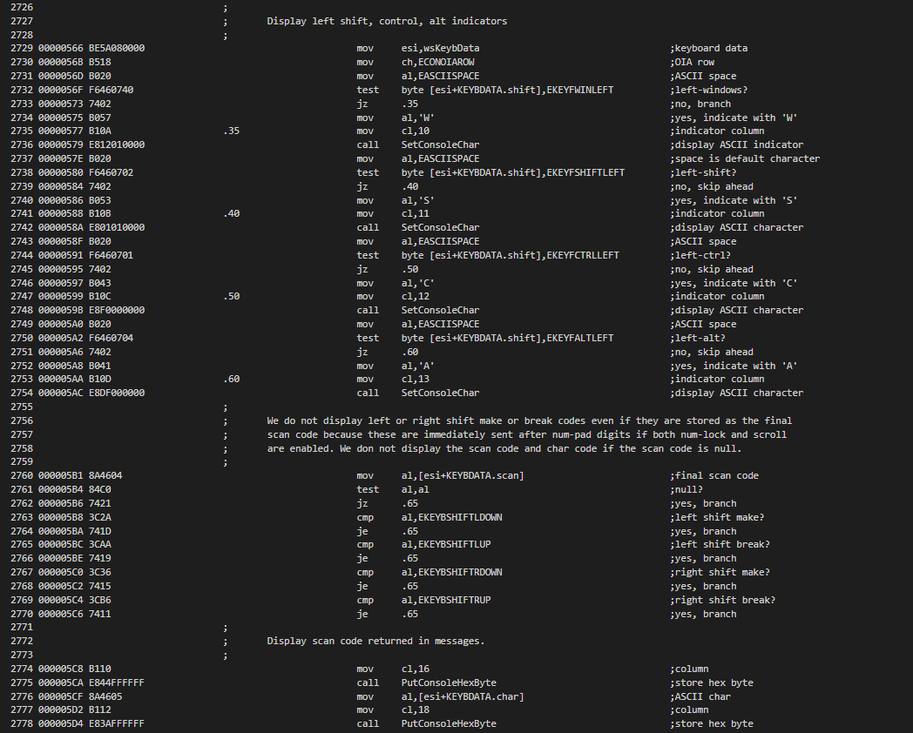 
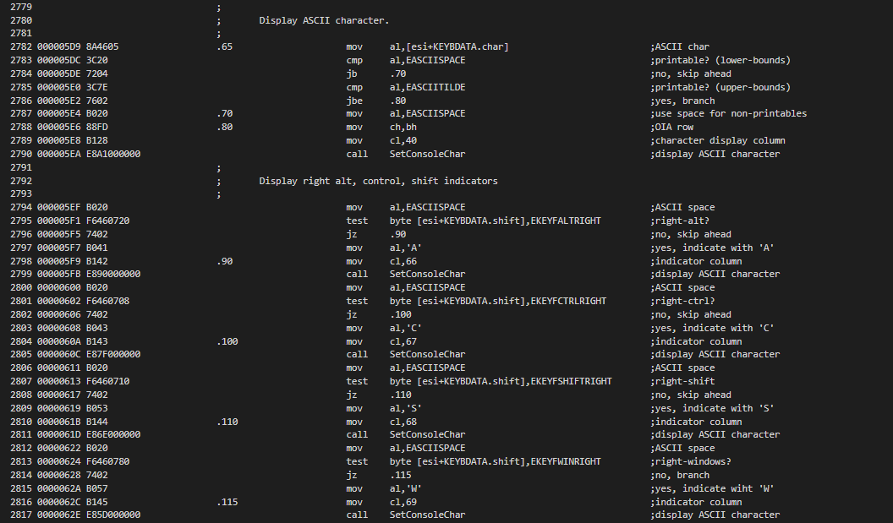 
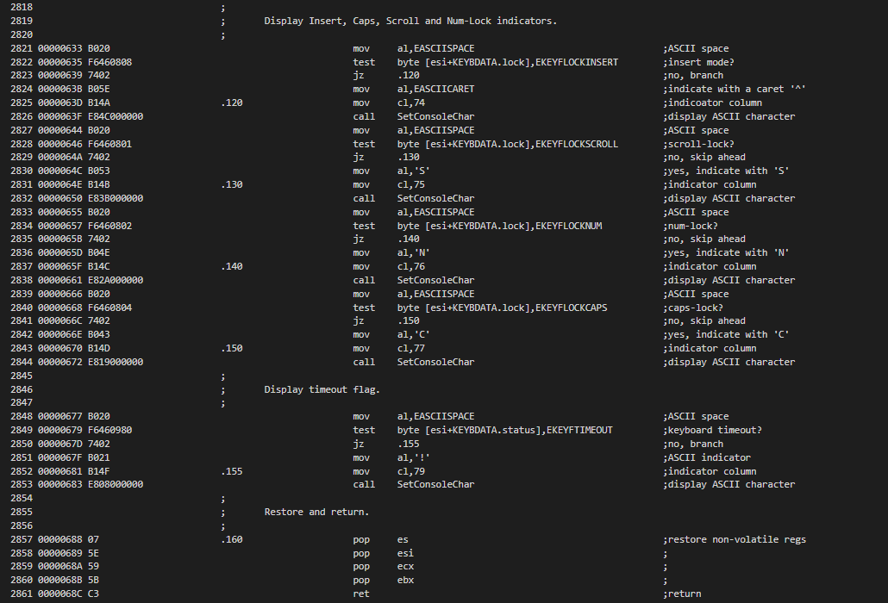

The Yield routine issues a HLT to allow any pending interrupt gain control.

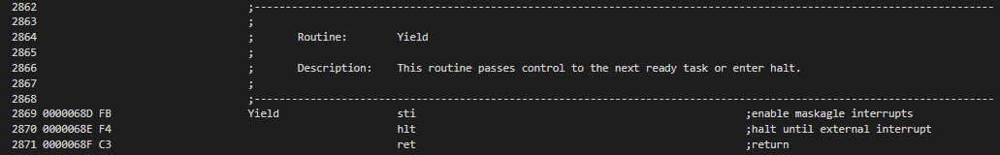

The SetConsoleChar I/O routine is added to convert a row and column to the CGA video memory offset and write a character at this location.

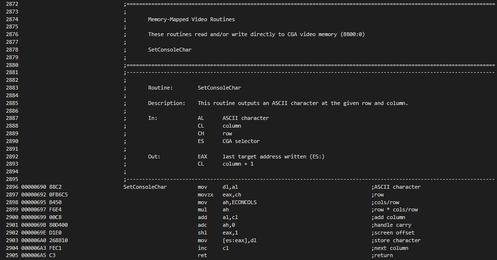

In the I/O Routines section we add three new routintes, SetKeyboardLamps, WaitForKeyInBuffer and WaitForKeyOutBuffer.

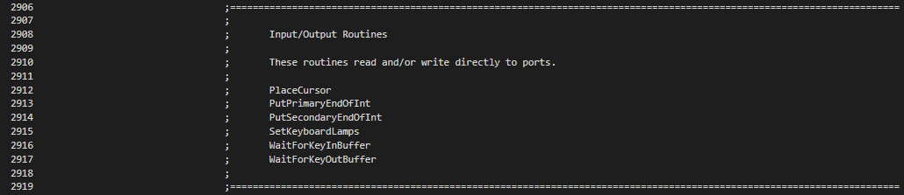

SetKeyboardLamps updates the LEDs for caps, scroll and num-lock. WaitForKeyInBuffer waits for the keyboard input buffer to be available. WaitForKeyOutBuffer waits for keyboard scan code data to be available in the output buffer.

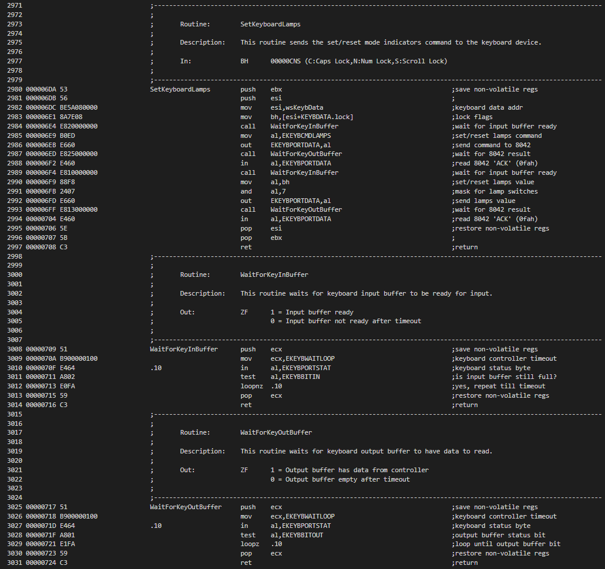

Finally, in the console task, we add several initialization statements to set the num-lock flag on startup, illuminate the lamps as needed, and draw the initial OIA.

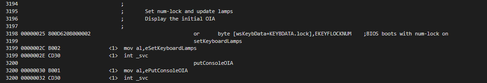
