### Project os.006
Source: [os.006/os.asm](../os.006/os.asm)

### Features and Topics
- Keyboard Controller I/O
- Keyboard Scan Code to ASCII translation

### [Virtual](VIRTUAL.md) Machine Operation
- Update the Virtual Machine configuration to use os.006/os.dsk as the diskette image.
- Start the Virtual Machine.

### [Physical](PHYSICAL.md) Machine Operation
- Overwrite os.com on the OS boot diskette with os.006/os.com.
- Insert the OS boot diskette into the physical system's floppy disk drive A:.
- Start the system.

### Notes

This project adds code for the Keyboard Interrupt handler (IRQ1). The interrupt handler reads scan codes from the 8042 keyboard controller and updates shift and key lock states. If the scan code translates into an printable ASCII scan code this is represented in the Operator Information Area (OIA).

In our Equates section, we add a new section for keyboard flags EKEYF...

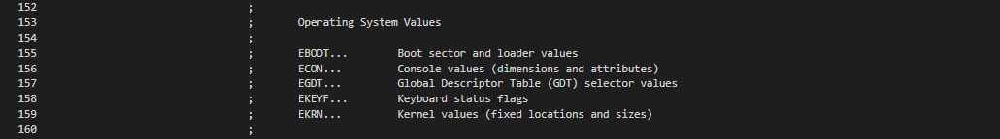

The existing section for keyboard codes is expanded to define specific keyboard scan codes used in the keyboard interrupt.

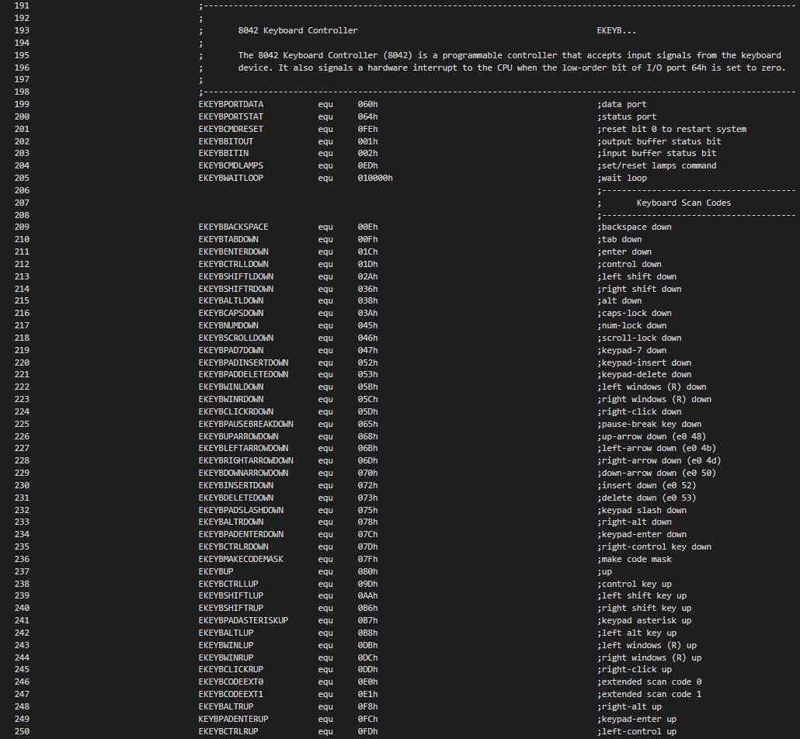

The ASCII codes section is expanded to add additional ASCII codes checked in the keyboard interrupt.

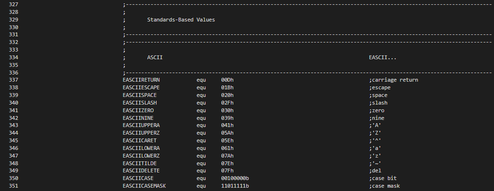

The OS tracks the state of shift and lock keys using flags in a console task storage word.

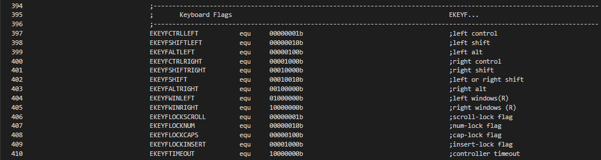

We define a KEYBDATA structure to group together the set of storage areas used to maintain the state of the keyboard.

In our kernel data area we define an instance of the KEYBDATA structure, called wsKeybData.

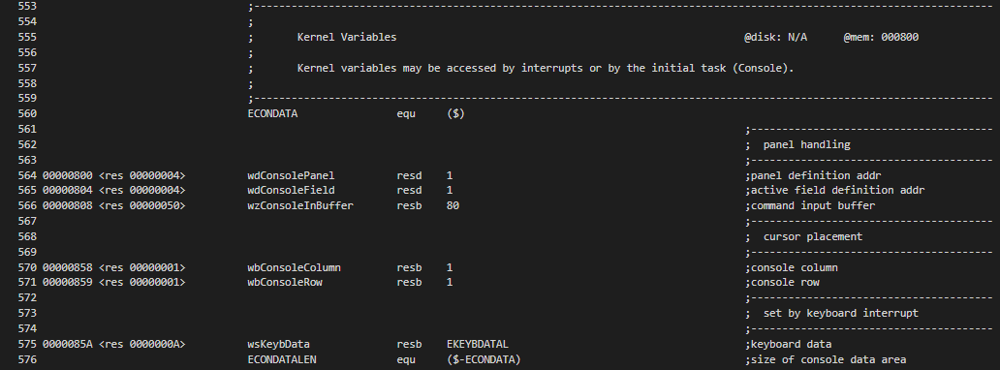

The keyboard interrupt starts by sending the end-of-interrupt signal to the PIC, resetting working areas, reading the first scan code. If the "e1" extended code is arrived, we want to take two additional scan codes for evaluation.

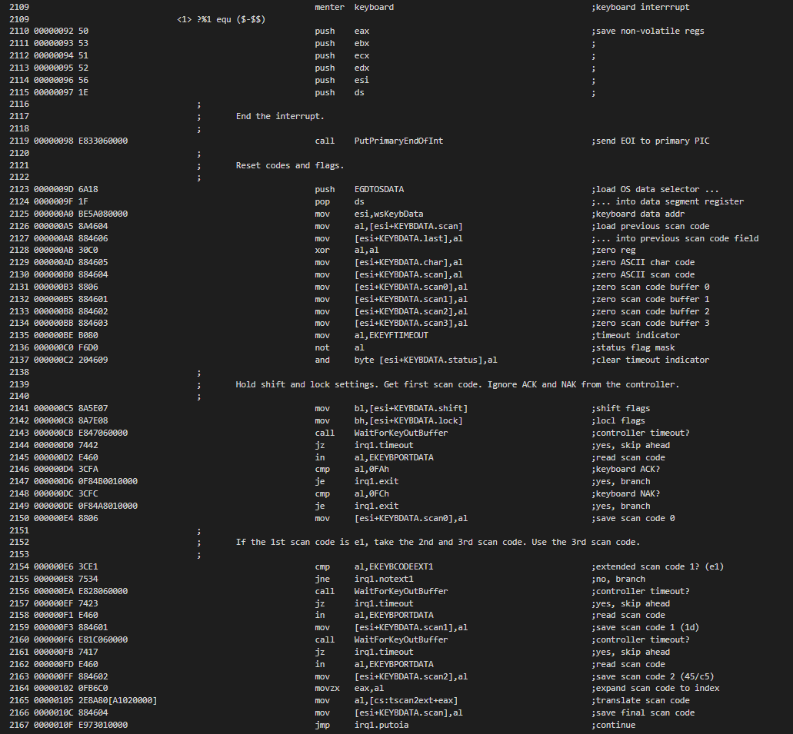

A keyboard read timeout should not normally occur, but we'll set a status bit if it does happen. The "e0" extended code requires we take one additional scan code. The Print Screen keyboard sends both the make and break code sequences immediately.

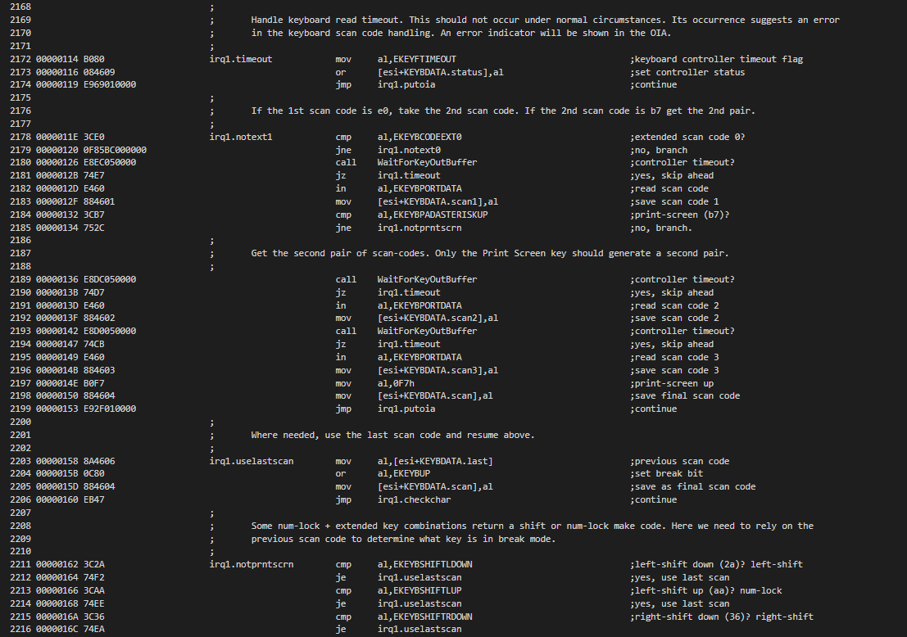

We use an OS-specific extended scan code table so that we return ONE scan code for key press or release. Some codes here will affect shift or lock key status flags.

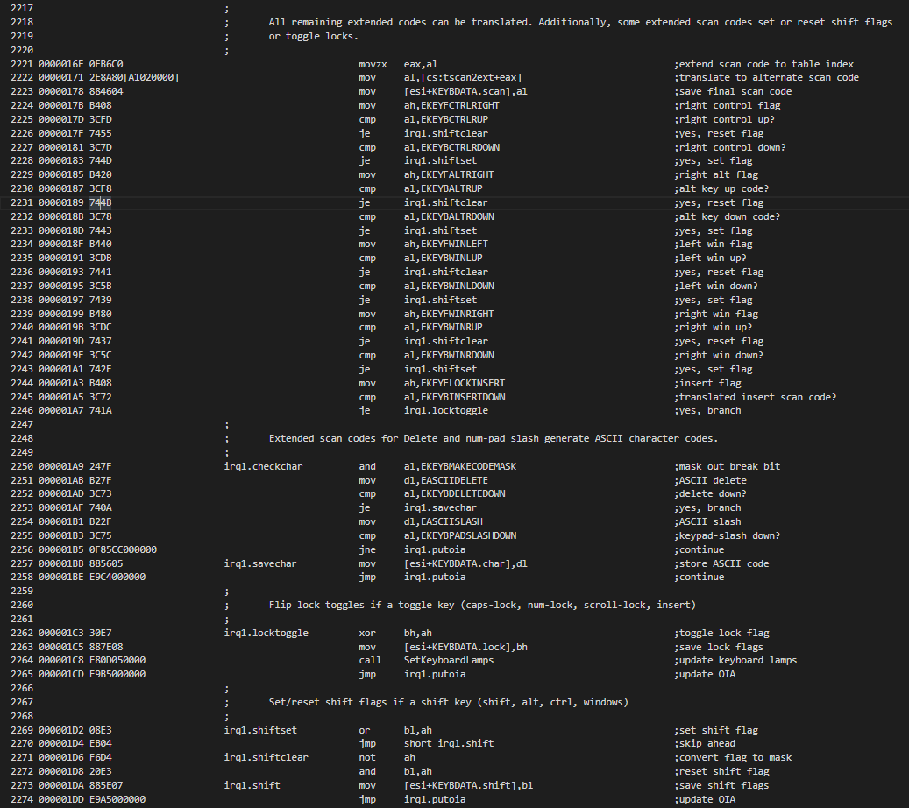

Single-byte scan codes may also update shift or lock flags. The remaining used to look-up corresponding ASCII base or shifted values.

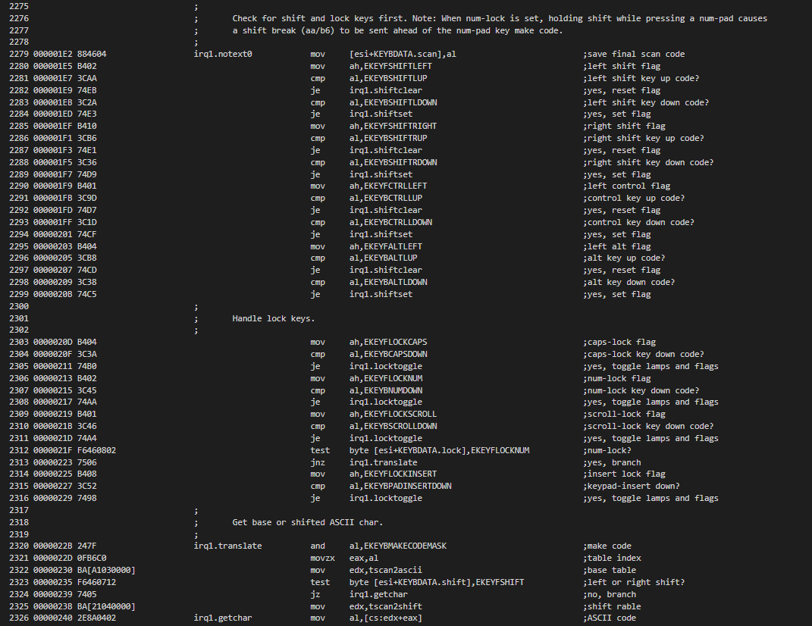

The case of the ASCII code may be affected by the state of the caps-lock and shift keys. Also, if NUM-LOCK is on, if may affect the codes returned by keys in the numeric key-pad. Once the final scan code and ASCII character, if any, is determined, we update the Operator Information Area (OIA). In a later project we will pass these codes to the active task using a message queue.

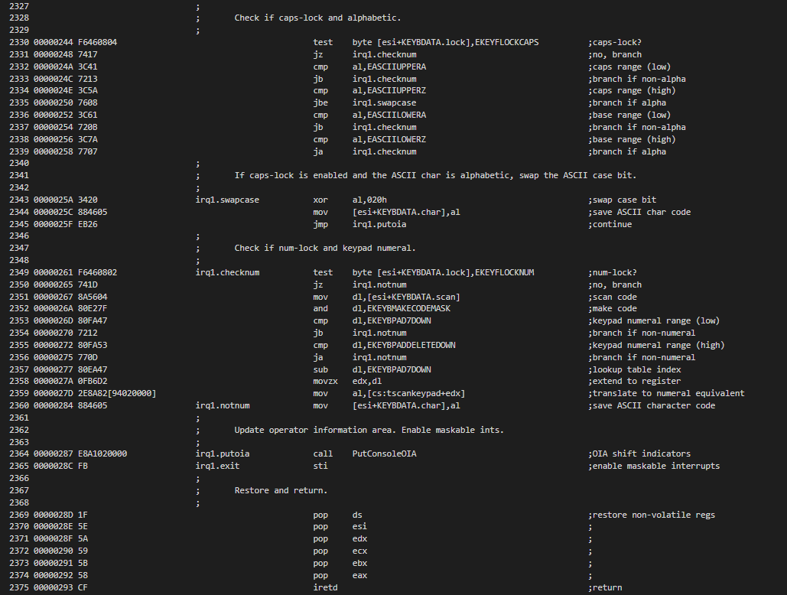

The translation tables used by they keyboard interrupt follow. These handle numeric key-pad, scan code to extended scan code, scan to ASCII base and scan to ASCII shifted.

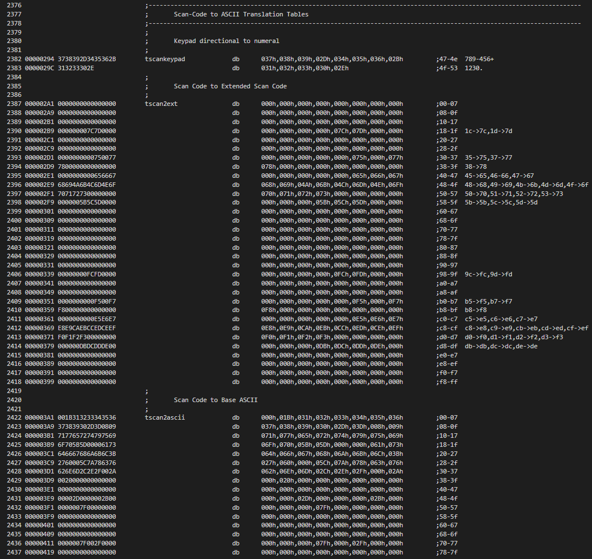
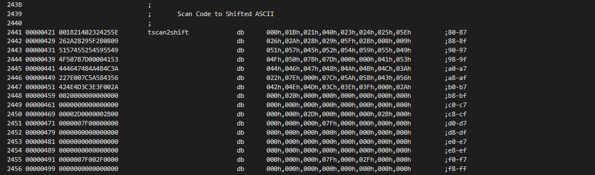
