### Project os.007
Source: [os.007/os.asm](../os.007/os.asm)

### Features and Topics
- Using a message queue to route event information to a task.

### [Virtual](VIRTUAL.md) Machine Operation
- Update the Virtual Machine configuration to use os.007/os.dsk as the diskette image.
- Start the Virtual Machine.

### [Physical](PHYSICAL.md) Machine Operation
- Overwrite os.com on the OS boot diskette with os.007/os.com.
- Insert the OS boot diskette into the physical system's floppy disk drive A:.
- Start the system.

### Notes

This project updates the Keyboard Interrupt introduced in the past project to send keyboard events to the console task.

First we define new equates for Local Descriptor Table (LDT) and Message Queue values.

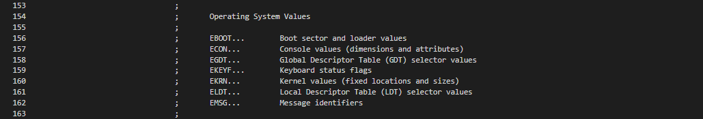

Some additional keyboard scan code equates have been added.

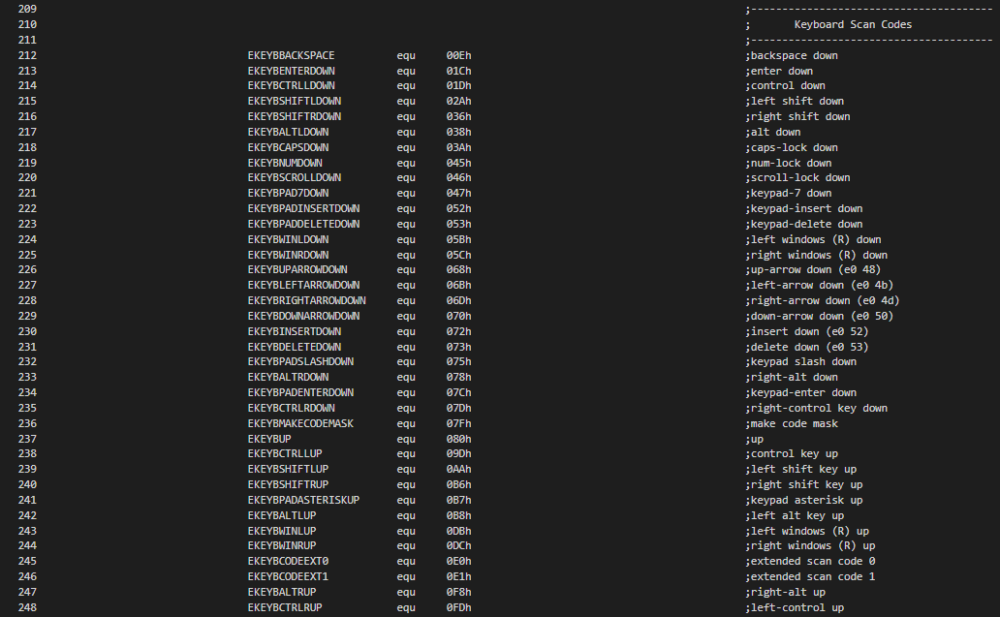

Symbolic constants have been added for task message queue entries and some message identifiers.

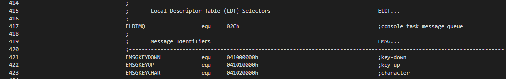

The MQUEUE structure defines the organization of a message queue storage area. The message queue receives event information from interrupt handlers.

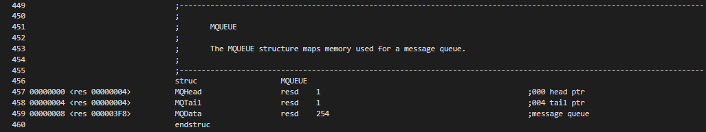

The Panel Handling section of fields in the console task storage area has a new field added to track the current panel handler. This is the address of the routine to be called to handle events for the panel.

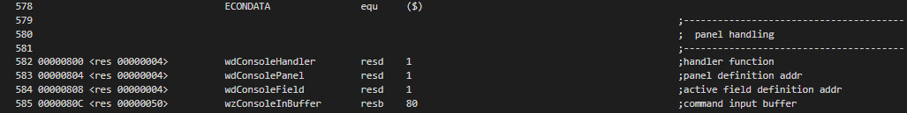

The Keyboard Interrupt Handler now creates and posts messages to the console task when a key is pressed or released and if a key code maps to a printable ASCII character. Additionally, in a few places (not shown), branches to .putoia now branch to .putmessage or .putkeydown.

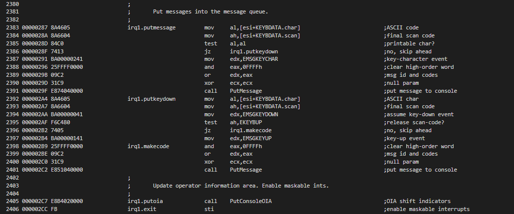

A new service request, GetConsoleMessage, is added which waits for a message to arrive for the console task.

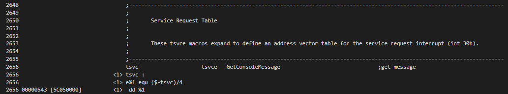

A new service request macro is defined for the GetConsoleMessage service request.

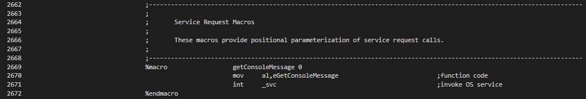

The GetConsoleMessage routine is added to the Console Helper Routines section of the kernel.

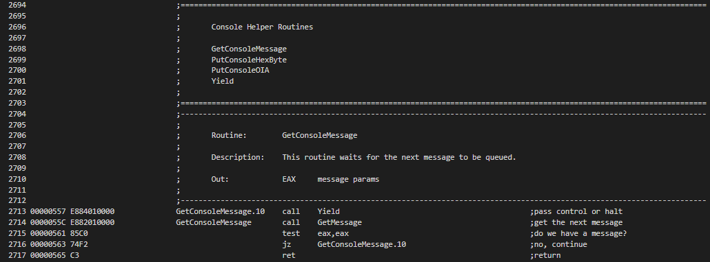

Two new helper routines, GetMessage and PutMessage

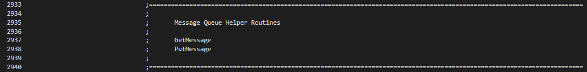 
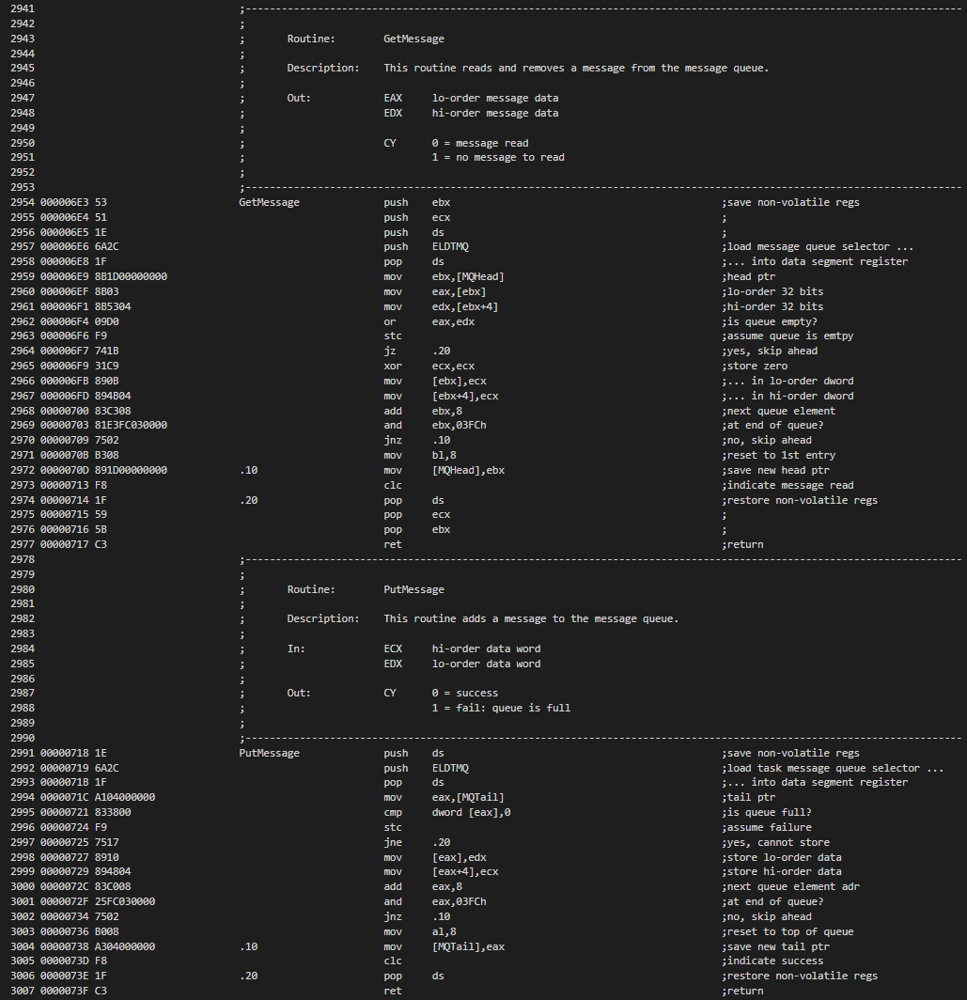

Two new routines are added to the console task, ConHandlerMain and ConClearField.

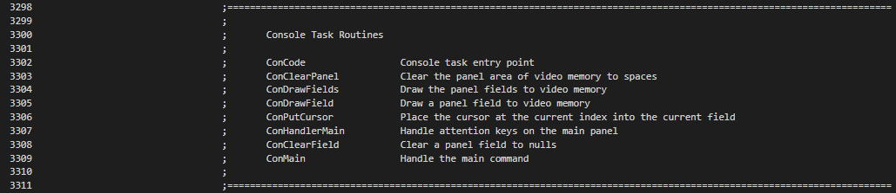

In ConCode, after the cursor is placed in the current field, new code is added to get the next key-down message, give it to the panel event handler, and, if the field has a buffer, handle arrow keys, backspace and printables, then redrawing the field.

 
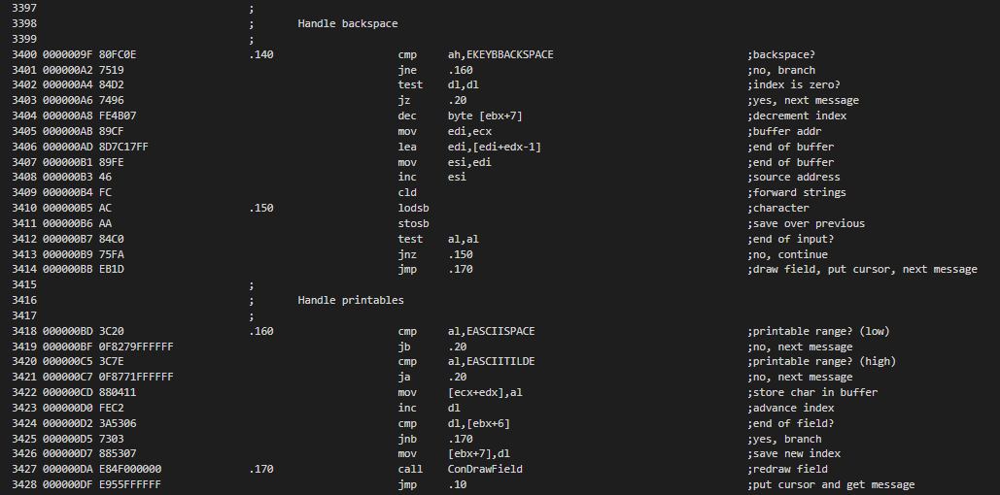

The ConHandlerMain routine handles events specific to the main panel. Events not handled here may be handled by the generic handler in ConCode.

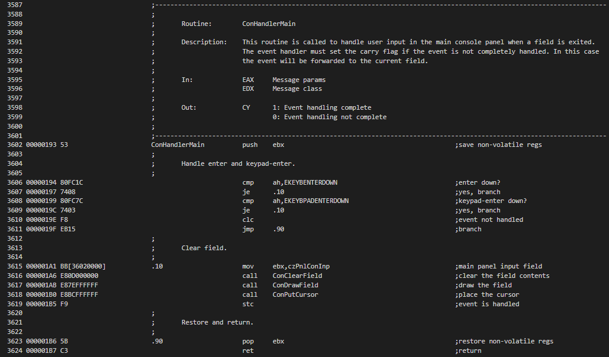

The ConClearField resets a field, usually an input field, by setting its index to zero and the contents of its buffer to zeros.

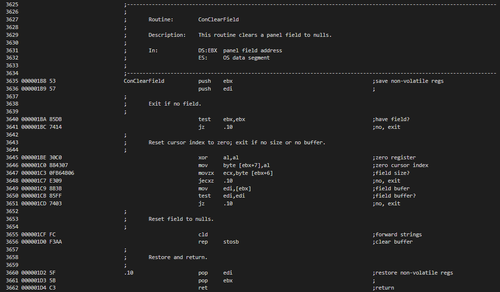

The ConMain routine now initializes the panel handler routine address which is defined in a table of routine offsets.

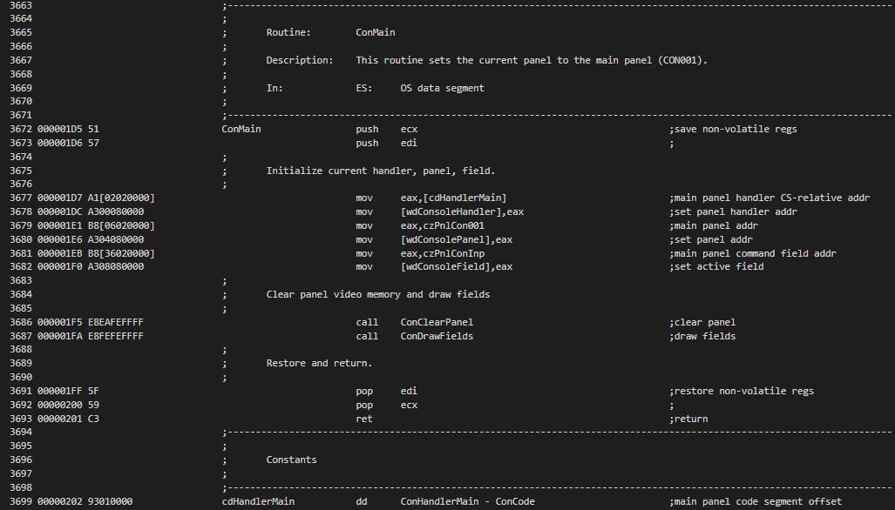
