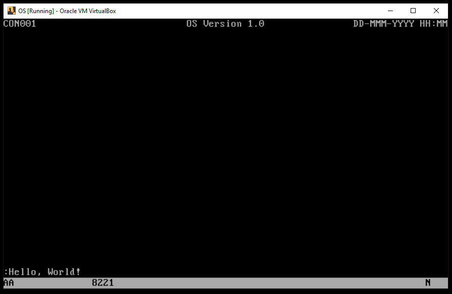
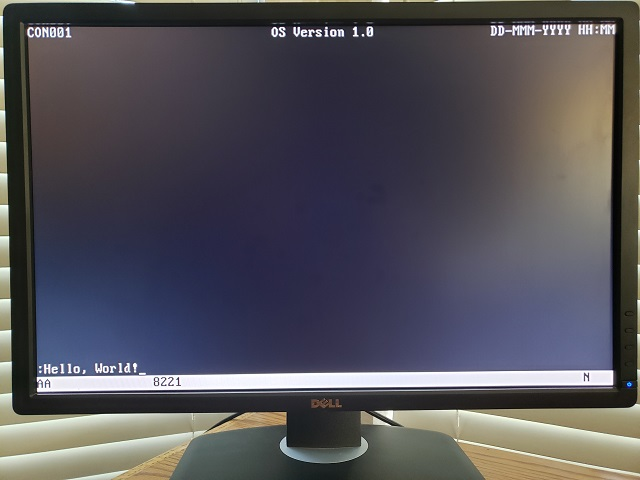

### Project os.007
Source: [os.007/os.asm](../os.007/os.asm)

### Features and Topics
- Using a message queue to route event information to a task.

### [Virtual](VIRTUAL.md) Machine Operation
- Update the Virtual Machine configuration to use os.007/os.dsk as the diskette image.
- Start the Virtual Machine.



### [Physical](PHYSICAL.md) Machine Operation
- Overwrite os.com on the OS boot diskette with os.007/os.com.
- Insert the OS boot diskette into the physical system's floppy disk drive A:.
- Start the system.



### Notes
This project updates the Keyboard Interrupt introduced in the past project to send keyboard events to the console task. First we define new equates for Local Descriptor Table (LDT) and Message Queue values.
```
;
;       Operating System Values
;
;       EBOOT...        Boot sector and loader values
;       ECON...         Console values (dimensions and attributes)
;       EGDT...         Global Descriptor Table (GDT) selector values
;       EKEYF...        Keyboard status flags
;       EKRN...         Kernel values (fixed locations and sizes)
;       ELDT...         Local Descriptor Table (LDT) selector values
;       EMSG...         Message identifiers
;
```
Some additional keyboard scan code equates have been added.

```
                                                                                ;---------------------------------------
                                                                                ;       Keyboard Scan Codes
                                                                                ;---------------------------------------
EKEYBBACKSPACE          equ     00Eh                                            ;backspace down
EKEYBENTERDOWN          equ     01Ch                                            ;enter down
EKEYBCTRLLDOWN          equ     01Dh                                            ;control down
EKEYBSHIFTLDOWN         equ     02Ah                                            ;left shift down
EKEYBSHIFTRDOWN         equ     036h                                            ;right shift down
EKEYBALTLDOWN           equ     038h                                            ;alt down
EKEYBCAPSDOWN           equ     03Ah                                            ;caps-lock down
EKEYBNUMDOWN            equ     045h                                            ;num-lock down
EKEYBSCROLLDOWN         equ     046h                                            ;scroll-lock down
EKEYBPAD7DOWN           equ     047h                                            ;keypad-7 down
EKEYBPADINSERTDOWN      equ     052h                                            ;keypad-insert down
EKEYBPADDELETEDOWN      equ     053h                                            ;keypad-delete down
EKEYBWINLDOWN           equ     05Bh                                            ;left windows (R) down
EKEYBWINRDOWN           equ     05Ch                                            ;right windows (R) down
EKEYBUPARROWDOWN        equ     068h                                            ;up-arrow down (e0 48)
EKEYBLEFTARROWDOWN      equ     06Bh                                            ;left-arrow down (e0 4b)
EKEYBRIGHTARROWDOWN     equ     06Dh                                            ;right-arrow down (e0 4d)
EKEYBDOWNARROWDOWN      equ     070h                                            ;down-arrow down (e0 50)
EKEYBINSERTDOWN         equ     072h                                            ;insert down (e0 52)
EKEYBDELETEDOWN         equ     073h                                            ;delete down (e0 53)
EKEYBPADSLASHDOWN       equ     075h                                            ;keypad slash down
EKEYBALTRDOWN           equ     078h                                            ;right-alt down
EKEYBPADENTERDOWN       equ     07Ch                                            ;keypad-enter down
EKEYBCTRLRDOWN          equ     07Dh                                            ;right-control key down
EKEYBMAKECODEMASK       equ     07Fh                                            ;make code mask
EKEYBUP                 equ     080h                                            ;up
EKEYBCTRLLUP            equ     09Dh                                            ;control key up
EKEYBSHIFTLUP           equ     0AAh                                            ;left shift key up
EKEYBSHIFTRUP           equ     0B6h                                            ;right shift key up
EKEYBPADASTERISKUP      equ     0B7h                                            ;keypad asterisk up
EKEYBALTLUP             equ     0B8h                                            ;left alt key up
EKEYBWINLUP             equ     0DBh                                            ;left windows (R) up
EKEYBWINRUP             equ     0DCh                                            ;right windows (R) up
EKEYBCODEEXT0           equ     0E0h                                            ;extended scan code 0
EKEYBCODEEXT1           equ     0E1h                                            ;extended scan code 1
EKEYBALTRUP             equ     0F8h                                            ;right-alt up
EKEYBCTRLRUP            equ     0FDh                                            ;left-control up
```
Symbolic constants have been added for task message queue entries and some message identifiers.
```
;-----------------------------------------------------------------------------------------------------------------------
;       Local Descriptor Table (LDT) Selectors                                  ELDT...
;-----------------------------------------------------------------------------------------------------------------------
ELDTMQ                  equ     02Ch                                            ;console task message queue
;-----------------------------------------------------------------------------------------------------------------------
;       Message Identifiers                                                     EMSG...
;-----------------------------------------------------------------------------------------------------------------------
EMSGKEYDOWN             equ     041000000h                                      ;key-down
EMSGKEYUP               equ     041010000h                                      ;key-up
EMSGKEYCHAR             equ     041020000h                                      ;character
```
The MQUEUE structure defines the organization of a message queue storage area. The message queue receives event information from interrupt handlers.
```
;-----------------------------------------------------------------------------------------------------------------------
;
;       MQUEUE
;
;       The MQUEUE structure maps memory used for a message queue.
;
;-----------------------------------------------------------------------------------------------------------------------
struc                   MQUEUE
MQHead                  resd    1                                               ;000 head ptr
MQTail                  resd    1                                               ;004 tail ptr
MQData                  resd    254                                             ;message queue
endstruc
```
The Panel Handling section of fields in the console task storage area has a new field added to track the current panel handler. This is the address of the routine to be called to handle events for the panel.
```
                                                                                ;---------------------------------------
                                                                                ;  panel handling
                                                                                ;---------------------------------------
wdConsoleHandler        resd    1                                               ;handler function
wdConsolePanel          resd    1                                               ;panel definition addr
wdConsoleField          resd    1                                               ;active field definition addr
wzConsoleInBuffer       resb    80                                              ;command input buffer
```
The Keyboard Interrupt Handler now creates and posts messages to the console task when a key is pressed or released and if a key code maps to a printable ASCII character. Additionally, in a few places (not shown), branches to .putoia now branch to .putmessage or .putkeydown.
```
;
;       Put messages into the message queue.
;
irq1.putmessage         mov     al,[esi+KEYBDATA.char]                          ;ASCII code
                        mov     ah,[esi+KEYBDATA.scan]                          ;final scan code
                        test    al,al                                           ;printable char?
                        jz      irq1.putkeydown                                 ;no, skip ahead
                        mov     edx,EMSGKEYCHAR                                 ;key-character event
                        and     eax,0FFFFh                                      ;clear high-order word
                        or      edx,eax                                         ;msg id and codes
                        xor     ecx,ecx                                         ;null param
                        call    PutMessage                                      ;put message to console
irq1.putkeydown         mov     al,[esi+KEYBDATA.char]                          ;ASCII char
                        mov     ah,[esi+KEYBDATA.scan]                          ;final scan code
                        mov     edx,EMSGKEYDOWN                                 ;assume key-down event
                        test    ah,EKEYBUP                                      ;release scan-code?
                        jz      irq1.makecode                                   ;no, skip ahead
                        mov     edx,EMSGKEYUP                                   ;key-up event
irq1.makecode           and     eax,0FFFFh                                      ;clear high-order word
                        or      edx,eax                                         ;msg id and codes
                        xor     ecx,ecx                                         ;null param
                        call    PutMessage                                      ;put message to console
;
;       Update operator information area. Enable maskable ints.
;
irq1.putoia             call    PutConsoleOIA                                   ;OIA shift indicators
irq1.exit               sti                                                     ;enable maskable interrupts
```
A new service request, GetConsoleMessage, is added which waits for a message to arrive for the console task.
```
tsvc                    tsvce   GetConsoleMessage                               ;get message
                        tsvce   PlaceCursor                                     ;place the cursor at the current loc
                        tsvce   PutConsoleOIA                                   ;display the operator information area
                        tsvce   SetKeyboardLamps                                ;turn keboard LEDs on or off
                        tsvce   Yield                                           ;yield to system
maxtsvc                 equ     ($-tsvc)/4                                      ;function out of range
```
A new service request macro is defined for the GetConsoleMessage service request.
```
%macro                  getConsoleMessage 0
                        mov     al,eGetConsoleMessage                           ;function code
                        int     _svc                                            ;invoke OS service
%endmacro
```
The GetConsoleMessage routine is added to the Console Helper Routines section of the kernel.
```
;=======================================================================================================================
;
;       Console Helper Routines
;
;       GetConsoleMessage
;       PutConsoleHexByte
;       PutConsoleOIA
;       Yield
;
;=======================================================================================================================
;-----------------------------------------------------------------------------------------------------------------------
;
;       Routine:        GetConsoleMessage
;
;       Description:    This routine waits for the next message to be queued.
;
;       Out:            EAX     message params
;
;-----------------------------------------------------------------------------------------------------------------------
GetConsoleMessage.10    call    Yield                                           ;pass control or halt
GetConsoleMessage       call    GetMessage                                      ;get the next message
                        test    eax,eax                                         ;do we have a message?
                        jz      GetConsoleMessage.10                            ;no, continue
                        ret                                                     ;return
```
Two new helper routines, GetMessage and PutMessage form the new Message Queue Helper Routines section.
```
;=======================================================================================================================
;
;       Message Queue Helper Routines
;
;       GetMessage
;       PutMessage
;
;=======================================================================================================================
;-----------------------------------------------------------------------------------------------------------------------
;
;       Routine:        GetMessage
;
;       Description:    This routine reads and removes a message from the message queue.
;
;       Out:            EAX     lo-order message data
;                       EDX     hi-order message data
;
;                       CY      0 = message read
;                               1 = no message to read
;
;-----------------------------------------------------------------------------------------------------------------------
GetMessage              push    ebx                                             ;save non-volatile regs
                        push    ecx                                             ;
                        push    ds                                              ;
                        push    ELDTMQ                                          ;load message queue selector ...
                        pop     ds                                              ;... into data segment register
                        mov     ebx,[MQHead]                                    ;head ptr
                        mov     eax,[ebx]                                       ;lo-order 32 bits
                        mov     edx,[ebx+4]                                     ;hi-order 32 bits
                        or      eax,edx                                         ;is queue empty?
                        stc                                                     ;assume queue is emtpy
                        jz      .20                                             ;yes, skip ahead
                        xor     ecx,ecx                                         ;store zero
                        mov     [ebx],ecx                                       ;... in lo-order dword
                        mov     [ebx+4],ecx                                     ;... in hi-order dword
                        add     ebx,8                                           ;next queue element
                        and     ebx,03FCh                                       ;at end of queue?
                        jnz     .10                                             ;no, skip ahead
                        mov     bl,8                                            ;reset to 1st entry
.10                     mov     [MQHead],ebx                                    ;save new head ptr
                        clc                                                     ;indicate message read
.20                     pop     ds                                              ;restore non-volatile regs
                        pop     ecx                                             ;
                        pop     ebx                                             ;
                        ret                                                     ;return
;-----------------------------------------------------------------------------------------------------------------------
;
;       Routine:        PutMessage
;
;       Description:    This routine adds a message to the message queue.
;
;       In:             ECX     hi-order data word
;                       EDX     lo-order data word
;
;       Out:            CY      0 = success
;                               1 = fail: queue is full
;
;-----------------------------------------------------------------------------------------------------------------------
PutMessage              push    ds                                              ;save non-volatile regs
                        push    ELDTMQ                                          ;load task message queue selector ...
                        pop     ds                                              ;... into data segment register
                        mov     eax,[MQTail]                                    ;tail ptr
                        cmp     dword [eax],0                                   ;is queue full?
                        stc                                                     ;assume failure
                        jne     .20                                             ;yes, cannot store
                        mov     [eax],edx                                       ;store lo-order data
                        mov     [eax+4],ecx                                     ;store hi-order data
                        add     eax,8                                           ;next queue element adr
                        and     eax,03FCh                                       ;at end of queue?
                        jnz     .10                                             ;no, skip ahead
                        mov     al,8                                            ;reset to top of queue
.10                     mov     [MQTail],eax                                    ;save new tail ptr
                        clc                                                     ;indicate success
.20                     pop     ds                                              ;restore non-volatile regs
                        ret                                                     ;return
```
Two new routines are added to the console task, ConHandlerMain and ConClearField.
```
;=======================================================================================================================
;
;       Console Task Routines
;
;       ConCode                 Console task entry point
;       ConClearPanel           Clear the panel area of video memory to spaces
;       ConDrawFields           Draw the panel fields to video memory
;       ConDrawField            Draw a panel field to video memory
;       ConPutCursor            Place the cursor at the current index into the current field
;       ConHandlerMain          Handle attention keys on the main panel
;       ConClearField           Clear a panel field to nulls
;       ConMain                 Handle the main command
;
;=======================================================================================================================
```
In ConCode, after the cursor is placed in the current field, new code is added to get the next key-down message, give it to the panel event handler, and, if the field has a buffer, handle arrow keys, backspace and printables, then redrawing the field.
```
;
;       Set the current panel to Main, clear and redraw all fields.
;
                        call    ConMain                                         ;initialize panel
;
;       Place the cursor at the current field index.
;
.10                     call    ConPutCursor                                    ;place the cursor
;
;       Get the next key-down message.
;
.20                     getConsoleMessage                                       ;get a console message
;
                        mov     edx,eax                                         ;message and params
                        and     edx,0FFFF0000h                                  ;mask for message
                        cmp     edx,EMSGKEYDOWN                                 ;keydown message?
                        jne     .20                                             ;no, next message
;
;       Give the message to the panel event-handler first.
;
                        mov     ecx,[wdConsoleHandler]                          ;handler addr?
                        jecxz   .30                                             ;no, branch
                        call    ecx                                             ;event handled?
                        jc     .20                                              ;yes, next message
;
;       To handle the event here, we need a current field that has a buffer.
;
.30                     mov     ebx,[wdConsoleField]                            ;field addr
                        test    ebx,ebx                                         ;field addr?
                        jz      .20                                             ;no, next message
                        mov     ecx,[ebx]                                       ;buffer addr?
                        jecxz   .20                                             ;no, next message
                        movzx   edx,byte [ebx+7]                                ;field index
;
;       Handle left or up arrow.
;
.100                    cmp     ah,EKEYBLEFTARROWDOWN                           ;left-arrow down?
                        je      .110                                            ;yes, branch
                        cmp     ah,EKEYBUPARROWDOWN                             ;up-arrow down?
                        jne     .120                                            ;no, branch
.110                    test    dl,dl                                           ;index is zero?
                        jz      .20                                             ;yes, next message
                        dec     byte [ebx+7]                                    ;decrement index
                        jmp     .10                                             ;put cursor and next message
;
;       Handle right or down arrow.
;
.120                    cmp     ah,EKEYBRIGHTARROWDOWN                          ;right-arrow down?
                        je      .130                                            ;yes, branch
                        cmp     ah,EKEYBDOWNARROWDOWN                           ;down-arrow down?
                        jne     .140                                            ;no, branch
.130                    cmp     byte [ecx+edx],0                                ;end of input?
                        je      .20                                             ;yes, next message
                        inc     dl                                              ;increment index
                        cmp     dl,byte [ebx+6]                                 ;end of field?
                        jnb     .20                                             ;yes, next message
                        mov     [ebx+7],dl                                      ;save new index
                        jmp     .10                                             ;put cursor and next message
;
;       Handle backspace
;
.140                    cmp     ah,EKEYBBACKSPACE                               ;backspace?
                        jne     .160                                            ;no, branch
                        test    dl,dl                                           ;index is zero?
                        jz      .20                                             ;yes, next message
                        dec     byte [ebx+7]                                    ;decrement index
                        mov     edi,ecx                                         ;buffer addr
                        lea     edi,[edi+edx-1]                                 ;end of buffer
                        mov     esi,edi                                         ;end of buffer
                        inc     esi                                             ;source address
                        cld                                                     ;forward strings
.150                    lodsb                                                   ;character
                        stosb                                                   ;save over previous
                        test    al,al                                           ;end of input?
                        jnz     .150                                            ;no, continue
                        jmp     .170                                            ;draw field, put cursor, next message
;
;       Handle printables
;
.160                    cmp     al,EASCIISPACE                                  ;printable range? (low)
                        jb      .20                                             ;no, next message
                        cmp     al,EASCIITILDE                                  ;printable range? (high)
                        ja      .20                                             ;no, next message
                        mov     [ecx+edx],al                                    ;store char in buffer
                        inc     dl                                              ;advance index
                        cmp     dl,[ebx+6]                                      ;end of field?
                        jnb     .170                                            ;yes, branch
                        mov     [ebx+7],dl                                      ;save new index
.170                    call    ConDrawField                                    ;redraw field
                        jmp     .10                                             ;put cursor and get message
```
The ConHandlerMain routine handles events specific to the main panel. Events not handled here may be handled by the generic handler in ConCode.
```
;-----------------------------------------------------------------------------------------------------------------------
;
;       Routine:        ConHandlerMain
;
;       Description:    This routine is called to handle user input in the main console panel when a field is exited.
;                       The event handler must set the carry flag if the event is not completely handled. In this case
;                       the event will be forwarded to the current field.
;
;       In:             EAX     Message params
;                       EDX     Message class
;
;       Out:            CY      1: Event handling complete
;                               0: Event handling not complete
;
;-----------------------------------------------------------------------------------------------------------------------
ConHandlerMain          push    ebx                                             ;save non-volatile regs
;
;       Handle enter and keypad-enter.
;
                        cmp     ah,EKEYBENTERDOWN                               ;enter down?
                        je      .10                                             ;yes, branch
                        cmp     ah,EKEYBPADENTERDOWN                            ;keypad-enter down?
                        je      .10                                             ;yes, branch
                        clc                                                     ;event not handled
                        jmp     .90                                             ;branch
;
;       Clear field.
;
.10                     mov     ebx,czPnlConInp                                 ;main panel input field
                        call    ConClearField                                   ;clear the field contents
                        call    ConDrawField                                    ;draw the field
                        call    ConPutCursor                                    ;place the cursor
                        stc                                                     ;event is handled
;
;       Restore and return.
;
.90                     pop     ebx                                             ;restore non-volatile regs
                        ret                                                     ;return
```
The ConClearField resets a field, usually an input field, by setting its index to zero and the contents of its buffer to zeros.
```
;-----------------------------------------------------------------------------------------------------------------------
;
;       Routine:        ConClearField
;
;       Description:    This routine clears a panel field to nulls.
;
;       In:             DS:EBX  panel field address
;                       ES:     OS data segment
;
;-----------------------------------------------------------------------------------------------------------------------
ConClearField           push    ebx                                             ;save non-volatile regs
                        push    edi                                             ;
;
;       Exit if no field.
;
                        test    ebx,ebx                                         ;have field?
                        jz      .10                                             ;no, exit
;
;       Reset cursor index to zero; exit if no size or no buffer.
;
                        xor     al,al                                           ;zero register
                        mov     byte [ebx+7],al                                 ;zero cursor index
                        movzx   ecx,byte [ebx+6]                                ;field size?
                        jecxz   .10                                             ;no, exit
                        mov     edi,[ebx]                                       ;field bufer
                        test    edi,edi                                         ;field buffer?
                        jz      .10                                             ;no, exit
;
;       Reset field to nulls.
;
                        cld                                                     ;forward strings
                        rep     stosb                                           ;clear buffer
;
;       Restore and return.
;
.10                     pop     edi                                             ;restore non-volatile regs
                        pop     ebx                                             ;
                        ret                                                     ;return
```
The ConMain routine now initializes the panel handler routine address which is defined in a table of routine offsets.
```
;-----------------------------------------------------------------------------------------------------------------------
;
;       Routine:        ConMain
;
;       Description:    This routine sets the current panel to the main panel (CON001).
;
;       In:             ES:     OS data segment
;
;-----------------------------------------------------------------------------------------------------------------------
ConMain                 push    ecx                                             ;save non-volatile regs
                        push    edi                                             ;
;
;       Initialize current handler, panel, field.
;
                        mov     eax,[cdHandlerMain]                             ;main panel handler CS-relative addr
                        mov     [wdConsoleHandler],eax                          ;set panel handler addr
                        mov     eax,czPnlCon001                                 ;main panel addr
                        mov     [wdConsolePanel],eax                            ;set panel addr
                        mov     eax,czPnlConInp                                 ;main panel command field addr
                        mov     [wdConsoleField],eax                            ;set active field
;
;       Clear panel video memory and draw fields
;
                        call    ConClearPanel                                   ;clear panel
                        call    ConDrawFields                                   ;draw fields
;
;       Restore and return.
;
                        pop     edi                                             ;restore non-volatile regs
                        pop     ecx                                             ;
                        ret                                                     ;return
```
