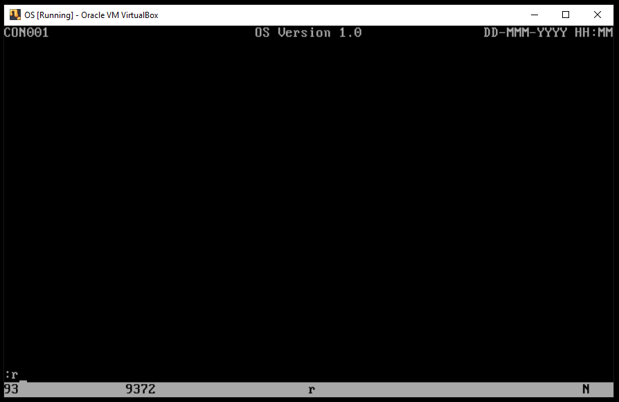
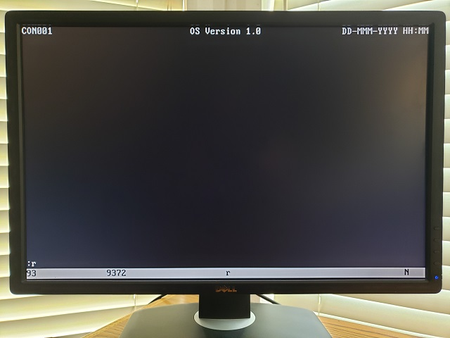

### Project os.008
Source: [os.008/os.asm](../os.008/os.asm)

### Features and Topics

### [Virtual](VIRTUAL.md) Machine Operation
- Update the Virtual Machine configuration to use os.008/os.dsk as the diskette image.
- Start the Virtual Machine.



### [Physical](PHYSICAL.md) Machine Operation
- Overwrite os.com on the OS boot diskette with os.008/os.com.
- Insert the OS boot diskette into the physical system's floppy disk drive A:.
- Start the system.



### Notes

This project extends the console task by adding code to interpret a command entered by the operator. The command input field is parsed to take its first token. The token is compared to a list of recognized commands. If the command is recognized, its handler routine is called. Here we add only the reset command, "r" and a new routine to process the command.

As our commands are case insensitive we'll add an UpperCase kernel routine to take operator input and convert it to all capitals before comparing to the command list. A simple mask is used to logically "AND" the lower-case ASCII alphabetic bit to zero.
```
EASCIICASEMASK          equ     11011111b                                       ;case mask
```
We we take the first token from the operator command it is placed in a separate buffer.

```
wzConsoleToken          resb    80                                              ;token buffer
```
Three new routines are added to the kernel service request table. CompareMemory, UpperCaseString and ResetSystem.
```
tsvc                    tsvce   CompareMemory                                   ;compare memory
                        tsvce   GetConsoleMessage                               ;get message
                        tsvce   PlaceCursor                                     ;place the cursor at the current loc
                        tsvce   PutConsoleOIA                                   ;display the operator information area
                        tsvce   ResetSystem                                     ;reset system using 8042 chip
                        tsvce   SetKeyboardLamps                                ;turn keboard LEDs on or off
                        tsvce   UpperCaseString                                 ;upper-case string
                        tsvce   Yield                                           ;yield to system
maxtsvc                 equ     ($-tsvc)/4                                      ;function out of range
```
Here are the macros to invoke the new service requests.
```
%macro                  compareMemory 0
                        mov     al,eCompareMemory                               ;function code
                        int     _svc                                            ;invoke OS service
%endmacro
%macro                  resetSystem 0
                        mov     al,eResetSystem                                 ;function code
                        int     _svc                                            ;invoke OS service
%endmacro
%macro                  upperCaseString 0
                        mov     al,eUpperCaseString                             ;function code
                        int     _svc                                            ;invoke OS service
%endmacro
```
The CompareMemory and UpperCaseString routines inaugurate a new Sting Helper Routines section of the kernel routine library.
```
;=======================================================================================================================
;
;       String Helper Routines
;
;       CompareMemory
;       UpperCaseString
;
;=======================================================================================================================
;-----------------------------------------------------------------------------------------------------------------------
;
;       Routine:        CompareMemory
;
;       Description:    This routine compares two byte arrays.
;
;       In:             DS:EDX  first source address
;                       DS:EBX  second source address
;                       ECX     comparison length
;
;       Out:            EDX     first source address
;                       EBX     second source address
;                       ECX     0       array 1 = array 2
;                               <0      array 1 < array 2
;                               >0      array 1 > array 2
;
;-----------------------------------------------------------------------------------------------------------------------
CompareMemory           push    esi                                             ;save non-volatile regs
                        push    edi                                             ;
                        push    es                                              ;
                        push    ds                                              ;copy DS
                        pop     es                                              ;... to ES
                        mov     esi,edx                                         ;first source address
                        mov     edi,ebx                                         ;second source address
                        cld                                                     ;forward strings
                        rep     cmpsb                                           ;compare bytes
                        mov     al,0                                            ;default result
                        jz      .10                                             ;branch if arrays equal
                        mov     al,1                                            ;positive result
                        jnc     .10                                             ;branch if target > source
                        mov     al,-1                                           ;negative result
.10                     movsx   ecx,al                                          ;extend sign
                        pop     es                                              ;restore non-volatile regs
                        pop     edi                                             ;
                        pop     esi                                             ;
                        ret                                                     ;return
;-----------------------------------------------------------------------------------------------------------------------
;
;       Routine:        UpperCaseString
;
;       Description:    This routine places all characters in the given string to upper case.
;
;       In:             DS:EDX  string address
;
;       Out:            EDX     string address
;
;-----------------------------------------------------------------------------------------------------------------------
UpperCaseString         push    esi                                             ;save non-volatile regs
                        mov     esi,edx                                         ;string address
                        cld                                                     ;forward strings
.10                     lodsb                                                   ;string character
                        test    al,al                                           ;null?
                        jz      .20                                             ;yes, skip ahead
                        cmp     al,EASCIILOWERA                                 ;lower-case? (lower bounds)
                        jb      .10                                             ;no, continue
                        cmp     al,EASCIILOWERZ                                 ;lower-case? (upper bounds)
                        ja      .10                                             ;no, continue
                        and     al,EASCIICASEMASK                               ;mask for upper case
                        mov     [esi-1],al                                      ;upper character
                        jmp     .10                                             ;continue
.20                     pop     esi                                             ;restore non-volatile regs
                        ret                                                     ;return
```
ResetSystem is added to our existing Input/Output Routines section.
```
;-----------------------------------------------------------------------------------------------------------------------
;
;       Routine:        ResetSystem
;
;       Description:    This routine restarts the system using the 8042 controller.
;
;       Out:            N/A     This routine does not return.
;
;-----------------------------------------------------------------------------------------------------------------------
ResetSystem             mov     ecx,001fffffh                                   ;delay to clear ints
                        loop    $                                               ;clear interrupts
                        mov     al,EKEYBCMDRESET                                ;mask out bit zero
                        out     EKEYBPORTSTAT,al                                ;drive bit zero low
.10                     sti                                                     ;enable maskable interrupts
                        hlt                                                     ;halt until interrupt
                        jmp     .10                                             ;repeat until reset kicks in
```
Now in ConHandlerMain, after we have detected the Enter key having been depressed, we insert code to take the first token from operator input, determine if it is a command and run the command's handler.
```
ConHandlerMain          push    ebx                                             ;save non-volatile regs
;
;       Handle enter and keypad-enter.
;
                        cmp     ah,EKEYBENTERDOWN                               ;enter down?
                        je      .10                                             ;yes, branch
                        cmp     ah,EKEYBPADENTERDOWN                            ;keypad-enter down?
                        je      .10                                             ;yes, branch
                        clc                                                     ;event not handled
                        jmp     .90                                             ;branch
;
;       Take the first token entered.
;
.10                     mov     edx,wzConsoleInBuffer                           ;console input buffer addr
                        mov     ebx,wzConsoleToken                              ;token buffer
                        call    ConTakeToken                                    ;take first command token
;
;       Evaluate token.
;
                        mov     edx,wzConsoleToken                              ;token buffer
                        call    ConDetermineCommand                             ;determine if this is a command
                        cmp     eax,ECONJMPTBLCNT                               ;command number in range?
                        jnb     .20                                             ;no, branch
                        shl     eax,2                                           ;convert number to array offset
                        mov     edx,tConJmpTbl                                  ;command handler address table base
                        mov     eax,[edx+eax]                                   ;command handler address
                        call    eax                                             ;handler command
;
;       Clear field.
;
.20                     mov     ebx,czPnlConInp                                 ;main panel input field
                        call    ConClearField                                   ;clear the field contents
                        call    ConDrawField                                    ;draw the field
                        call    ConPutCursor                                    ;place the cursor
                        stc                                                     ;event is handled
;
;       Restore and return.
;
.90                     pop     ebx                                             ;restore non-volatile regs
                        ret                                                     ;return
```
Here we have introduced three new routines in the console task. ConTakeToken, ConDetermineCommand and ConReset.
```
;-----------------------------------------------------------------------------------------------------------------------
;
;       Routine:        ConTakeToken
;
;       Description:    This routine extracts the next token from the given source buffer.
;
;       In:             DS:EDX  source buffer address
;                       DS:EBX  target buffer address
;
;       Out:            DS:EDX  source buffer address
;                       DS:EBX  target buffer address
;
;       Command Form:   Line    = *3( *SP 1*ALNUM )
;
;-----------------------------------------------------------------------------------------------------------------------
ConTakeToken            push    esi                                             ;save non-volatile regs
                        push    edi                                             ;
                        push    es                                              ;
;
;       Address source and target; null-terminate target buffer.
;
                        push    ds                                              ;load data segment selector ...
                        pop     es                                              ;... into extra segment reg
                        mov     esi,edx                                         ;source buffer address
                        mov     edi,ebx                                         ;target buffer address
                        mov     byte [edi],0                                    ;null-terminate target buffer
;
;       Trim leading space; exit if no token.
;
                        cld                                                     ;forward strings
.10                     lodsb                                                   ;load byte
                        cmp     al,EASCIISPACE                                  ;space?
                        je      .10                                             ;yes, continue
                        test    al,al                                           ;end of line?
                        jz      .40                                             ;yes, branch
;
;       Store non-spaces into target buffer.
;
.20                     stosb                                                   ;store byte
                        lodsb                                                   ;load byte
                        test    al,al                                           ;end of line?
                        jz      .40                                             ;no, continue
                        cmp     al,EASCIISPACE                                  ;space?
                        jne     .20                                             ;no, continue
;
;       Walk over spaces trailing the stored token; point to final space.
;
.30                     lodsb                                                   ;load byte
                        cmp     al,EASCIISPACE                                  ;space?
                        je      .30                                             ;yes, continue
                        dec     esi                                             ;pre-position
;
;       Null-terminate target buffer; advance remaining source bytes.
;
.40                     mov     byte [edi],0                                    ;terminate buffer
                        mov     edi,edx                                         ;source buffer address
.50                     lodsb                                                   ;remaining byte
                        stosb                                                   ;move to front of buffer
                        test    al,al                                           ;end of line?
                        jnz     .50                                             ;no, continue
;
;       Restore and return.
;
                        pop     es                                              ;restore non-volatile regs
                        pop     edi                                             ;
                        pop     esi                                             ;
                        ret                                                     ;return
;-----------------------------------------------------------------------------------------------------------------------
;
;       Routine:        ConDetermineCommand
;
;       Description:    This routine determines the command number for the command at DS:EDX.
;
;       input:          DS:EDX  command address
;
;       output:         EAX     !ECONJMPTBLCNT = command nbr
;                               ECONJMPTBLCNT = no match fond
;
;-----------------------------------------------------------------------------------------------------------------------
ConDetermineCommand     push    ebx                                             ;save non-volatile regs
                        push    ecx                                             ;
                        push    esi                                             ;
                        push    edi                                             ;
;
;       Upper-case the command; prepare to search command table.
;
                        upperCaseString                                         ;upper-case string at EDX
                        mov     esi,tConCmdTbl                                  ;commands table
                        xor     edi,edi                                         ;intialize command number
                        cld                                                     ;forward strings
;
;       Exit if end of table.
;
.10                     lodsb                                                   ;command length
                        movzx   ecx,al                                          ;command length
                        jecxz   .20                                             ;branch if end of table
;
;       Compare command to table entry; exit if match.
;
                        mov     ebx,esi                                         ;table entry address
                        add     esi,ecx                                         ;next table entry address
                        compareMemory                                           ;compare byte arrays at EDX, EBX
                        jecxz   .20                                             ;branch if equal
;
;       Next table element.
;
                        inc     edi                                             ;increment command nbr
                        jmp     .10                                             ;repeat
;
;       Return command number or ECONJMPTBLCNT.
;
.20                     mov     eax,edi                                         ;command number
;
;       Restore and return.
;
                        pop     edi                                             ;restore non-volatile regs
                        pop     esi                                             ;
                        pop     ecx                                             ;
                        pop     ebx                                             ;
                        ret                                                     ;return
;-----------------------------------------------------------------------------------------------------------------------
;
;       Routine:        ConReset
;
;       Description:    This routine handles the reset command.
;
;-----------------------------------------------------------------------------------------------------------------------
ConReset                resetSystem                                             ;issue system reset
                        ret                                                     ;return
```
Lastly, we have added two tables in the console task, one to address command handlers and a second to list known commands.
```
;-----------------------------------------------------------------------------------------------------------------------
;
;       Tables
;
;-----------------------------------------------------------------------------------------------------------------------
                                                                                ;---------------------------------------
                                                                                ;  Command Jump Table
                                                                                ;---------------------------------------
tConJmpTbl              equ     $                                               ;command jump table
                        dd      ConReset        - ConCode                       ;reset command
ECONJMPTBLL             equ     ($-tConJmpTbl)                                  ;table length
ECONJMPTBLCNT           equ     ECONJMPTBLL/4                                   ;table entries
                                                                                ;---------------------------------------
                                                                                ;  Command Name Table
                                                                                ;---------------------------------------
tConCmdTbl              equ     $                                               ;command name table
                        db      2,"R",0                                         ;reboot/restart command
                        db      0                                               ;end of table
```