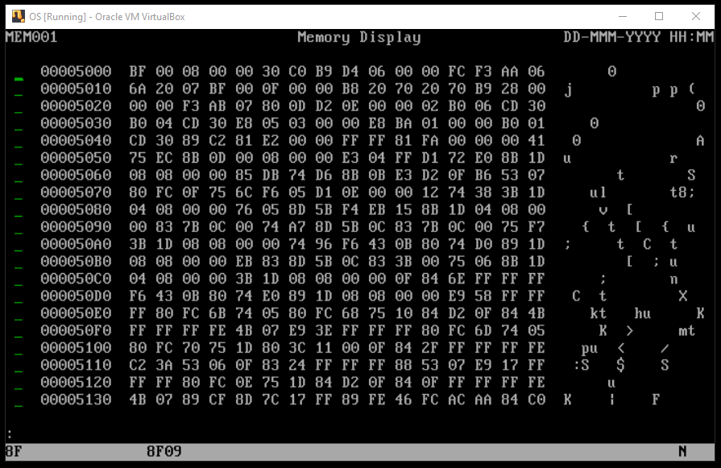
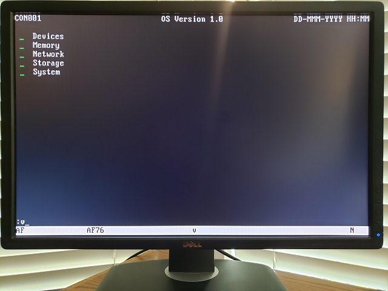

### Project os.010
Source: [os.010/os.asm](../os.010/os.asm)

### Features and Topics

### [Virtual](VIRTUAL.md) Machine Operation
- Update the Virtual Machine configuration to use os.010/os.dsk as the diskette image.
- Start the Virtual Machine.

### [Physical](PHYSICAL.md) Machine Operation
- Overwrite os.com on the OS boot diskette with os.010/os.com.
- Insert the OS boot diskette into the physical system's floppy disk drive A:.
- Start the system.

### Notes
