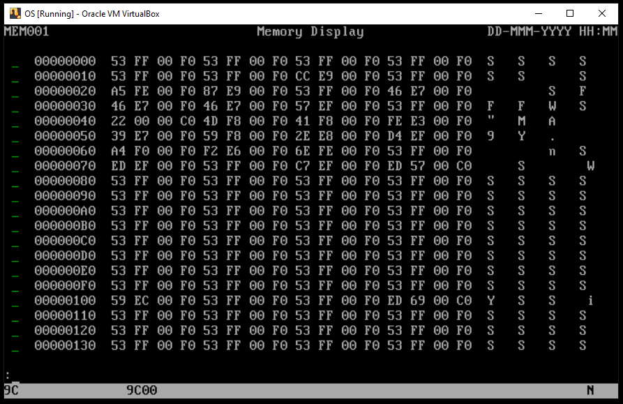
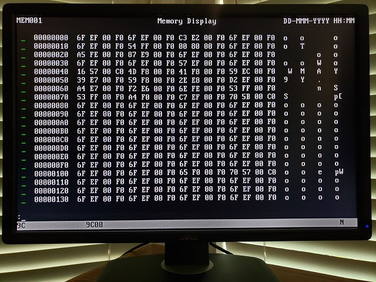

### Project os.010
Source: [os.010/os.asm](../os.010/os.asm)

### Features and Topics

### [Virtual](VIRTUAL.md) Machine Operation
- Update the Virtual Machine configuration to use os.010/os.dsk as the diskette image.
- Start the Virtual Machine.

<br>
<br>

### [Physical](PHYSICAL.md) Machine Operation
- Overwrite os.com on the OS boot diskette with os.010/os.com.
- Insert the OS boot diskette into the physical system's floppy disk drive A:.
- Start the system.

<br>
<br>

### Notes
This projects adds a second panel, the default view panel, that displays the values of memory locations. The view ("v") and go ("g") commands are added. First, we have added a scan-code and an ASCII equate.
```
EKEYBTABDOWN            equ     00Fh                                            ;tab down
```
```
EASCIIUNDERSCORE        equ     05Fh                                            ;'_'
```
In our console variable storage area we have added a variable to track the base address of the memory we are viewing and two arrays of storage for our row command fields and the row display fields.
```
wdConsoleMemBase        resd    1                                               ;console memory address
```
```
                                                                                ;---------------------------------------
                                                                                ;  memory panel fields
                                                                                ;---------------------------------------
                                                                                ;0123456789012345678901234567890123456789012345678901234567890123456789012345
wzConsoleMemBuf0        resb    76                                              ;aaaaaaaa  xx xx xx xx xx xx xx xx xx xx xx xx xx xx xx xx  ................\0
wzConsoleMemBuf1        resb    76                                              ;aaaaaaaa  xx xx xx xx xx xx xx xx xx xx xx xx xx xx xx xx  ................\0
wzConsoleMemBuf2        resb    76                                              ;aaaaaaaa  xx xx xx xx xx xx xx xx xx xx xx xx xx xx xx xx  ................\0
wzConsoleMemBuf3        resb    76                                              ;aaaaaaaa  xx xx xx xx xx xx xx xx xx xx xx xx xx xx xx xx  ................\0
wzConsoleMemBuf4        resb    76                                              ;aaaaaaaa  xx xx xx xx xx xx xx xx xx xx xx xx xx xx xx xx  ................\0
wzConsoleMemBuf5        resb    76                                              ;aaaaaaaa  xx xx xx xx xx xx xx xx xx xx xx xx xx xx xx xx  ................\0
wzConsoleMemBuf6        resb    76                                              ;aaaaaaaa  xx xx xx xx xx xx xx xx xx xx xx xx xx xx xx xx  ................\0
wzConsoleMemBuf7        resb    76                                              ;aaaaaaaa  xx xx xx xx xx xx xx xx xx xx xx xx xx xx xx xx  ................\0
wzConsoleMemBuf8        resb    76                                              ;aaaaaaaa  xx xx xx xx xx xx xx xx xx xx xx xx xx xx xx xx  ................\0
wzConsoleMemBuf9        resb    76                                              ;aaaaaaaa  xx xx xx xx xx xx xx xx xx xx xx xx xx xx xx xx  ................\0
wzConsoleMemBufA        resb    76                                              ;aaaaaaaa  xx xx xx xx xx xx xx xx xx xx xx xx xx xx xx xx  ................\0
wzConsoleMemBufB        resb    76                                              ;aaaaaaaa  xx xx xx xx xx xx xx xx xx xx xx xx xx xx xx xx  ................\0
wzConsoleMemBufC        resb    76                                              ;aaaaaaaa  xx xx xx xx xx xx xx xx xx xx xx xx xx xx xx xx  ................\0
wzConsoleMemBufD        resb    76                                              ;aaaaaaaa  xx xx xx xx xx xx xx xx xx xx xx xx xx xx xx xx  ................\0
wzConsoleMemBufE        resb    76                                              ;aaaaaaaa  xx xx xx xx xx xx xx xx xx xx xx xx xx xx xx xx  ................\0
wzConsoleMemBufF        resb    76                                              ;aaaaaaaa  xx xx xx xx xx xx xx xx xx xx xx xx xx xx xx xx  ................\0
wzConsoleMemBuf10       resb    76                                              ;aaaaaaaa  xx xx xx xx xx xx xx xx xx xx xx xx xx xx xx xx  ................\0
wzConsoleMemBuf11       resb    76                                              ;aaaaaaaa  xx xx xx xx xx xx xx xx xx xx xx xx xx xx xx xx  ................\0
wzConsoleMemBuf12       resb    76                                              ;aaaaaaaa  xx xx xx xx xx xx xx xx xx xx xx xx xx xx xx xx  ................\0
wzConsoleMemBuf13       resb    76                                              ;aaaaaaaa  xx xx xx xx xx xx xx xx xx xx xx xx xx xx xx xx  ................\0
                                                                                ;---------------------------------------
                                                                                ;  reusable menu option input
                                                                                ;---------------------------------------
wzFldMenuOptn0          resb    2                                               ;menu option 0  _\0
wzFldMenuOptn1          resb    2                                               ;menu option 1
wzFldMenuOptn2          resb    2                                               ;menu option 2
wzFldMenuOptn3          resb    2                                               ;menu option 3
wzFldMenuOptn4          resb    2                                               ;menu option 4
wzFldMenuOptn5          resb    2                                               ;menu option 5
wzFldMenuOptn6          resb    2                                               ;menu option 6
wzFldMenuOptn7          resb    2                                               ;menu option 7
wzFldMenuOptn8          resb    2                                               ;menu option 8
wzFldMenuOptn9          resb    2                                               ;menu option 9
wzFldMenuOptnA          resb    2                                               ;menu option A
wzFldMenuOptnB          resb    2                                               ;menu option B
wzFldMenuOptnC          resb    2                                               ;menu option C
wzFldMenuOptnD          resb    2                                               ;menu option D
wzFldMenuOptnE          resb    2                                               ;menu option E
wzFldMenuOptnF          resb    2                                               ;menu option F
wzFldMenuOptn10         resb    2                                               ;menu option 10
wzFldMenuOptn11         resb    2                                               ;menu option 11
wzFldMenuOptn12         resb    2                                               ;menu option 12
wzFldMenuOptn13         resb    2                                               ;menu option 13
```
Two new service routines, HexadecimalToUnsigned and UnsignedToHexadecimal, assist in converting hexadecimal to decimal memory address values.
```
                        tsvce   HexadecimalToUnsigned                           ;convert hexadecimal string to unsigned integer
                        tsvce   UnsignedToHexadecimal                           ;convert unsigned integer to hexadecimal string
```
```
%macro                  hexadecimalToUnsigned 0
                        mov     al,eHexadecimalToUnsigned                       ;function code
                        int     _svc                                            ;invoke OS service
%endmacro
%macro                  unsignedToHexadecimal 0
                        mov     al,eUnsignedToHexadecimal                       ;function code
                        int     _svc                                            ;invoke OS service
%endmacro
```
```
;=======================================================================================================================
;
;       Data-Type Conversion Helper Routines
;
;       HexadecimalToUnsigned
;       UnsignedToHexadecimal
;
;=======================================================================================================================
;-----------------------------------------------------------------------------------------------------------------------
;
;       Routine:        HexadecimalToUnsigned
;
;       Description:    This routine returns an unsigned integer of the value of the input ASCIIZ hexadecimal string.
;
;       Input:          DS:EDX  null-terminated hexadecimal string address
;
;       Output:         EAX     unsigned integer value
;
;-----------------------------------------------------------------------------------------------------------------------
HexadecimalToUnsigned   push    esi                                             ;save non-volatile regs
                        mov     esi,edx                                         ;source address
                        xor     edx,edx                                         ;zero register
.10                     lodsb                                                   ;source byte
                        test    al,al                                           ;end of string?
                        jz      .30                                             ;yes, branch
                        cmp     al,'9'                                          ;hexadecimal?
                        jna     .20                                             ;no, skip ahead
                        sub     al,037h                                         ;'A' = 41h, less 37h = 0Ah
.20                     and     eax,00Fh                                        ;remove ascii zone
                        shl     edx,4                                           ;previous total x 16
                        add     edx,eax                                         ;add prior value x 16
                        jmp     .10                                             ;next
.30                     mov     eax,edx                                         ;result
                        pop     esi                                             ;restore non-volatile regs
                        ret                                                     ;return
;-----------------------------------------------------------------------------------------------------------------------
;
;       Routine:        UnsignedToHexadecimal
;
;       Description:    This routine creates an ASCIIZ string representing the hexadecimal value of binary input
;
;       Input:          DS:EDX  output buffer address
;                       ECX     32-bit binary
;
;-----------------------------------------------------------------------------------------------------------------------
UnsignedToHexadecimal   push    edi                                             ;store non-volatile regs
                        mov     edi,edx                                         ;output buffer address
                        mov     edx,ecx                                         ;32-bit unsigned
                        xor     ecx,ecx                                         ;zero register
                        mov     cl,8                                            ;nybble count
.10                     rol     edx,4                                           ;next hi-order nybble in bits 0-3
                        mov     al,dl                                           ;????bbbb
                        and     al,00Fh                                         ;mask out bits 4-7
                        or      al,EASCIIZERO                                   ;mask in ascii zone
                        cmp     al,EASCIININE                                   ;A through F?
                        jbe     .20                                             ;no, skip ahead
                        add     al,7                                            ;41h through 46h
.20                     stosb                                                   ;store hexnum
                        loop    .10                                             ;next nybble
                        xor     al,al                                           ;zero reg
                        stosb                                                   ;null terminate
                        pop     edi                                             ;restore non-volatile regs
                        ret                                                     ;return
```
In ConCode, new code handles the forward and backward tab key.
```
;
;       Handle tab down and shift-tab down to navigate panel fields.
;
                        cmp     ah,EKEYBTABDOWN                                 ;tab down?
                        jne     .100                                            ;no, branch
                        test    byte [wsKeybData+KEYBDATA.shift],EKEYFSHIFT     ;shift?
                        jz      .80                                             ;no, tab forward
;
;       Handle backward-tab.
;
.40                     cmp     ebx,[wdConsolePanel]                            ;at first field?
                        jna     .50                                             ;yes, branch
                        lea     ebx,[ebx-12]                                    ;previous field
                        jmp     .70                                             ;branch
.50                     mov     ebx,[wdConsolePanel]                            ;sanity check
                        cmp     dword [ebx+12],0                                ;last field?
                        je      .20                                             ;yes, next message (only 1 field)
.60                     lea     ebx,[ebx+12]                                    ;next field
                        cmp     dword [ebx+12],0                                ;last field?
                        jne     .60                                             ;no, continue
.70                     cmp     ebx,[wdConsoleField]                            ;back to current field?
                        je      .20                                             ;yes, next message
                        test    byte [ebx+11],80h                               ;input field?
                        jz      .40                                             ;no, next field
                        mov     [wdConsoleField],ebx                            ;set current field
                        jmp     .10                                             ;place cursor and get message
;
;       Handle forward-tab.
.80                     lea     ebx,[ebx+12]                                    ;next field addr
                        cmp     dword [ebx],0                                   ;end of panel?
                        jne     .90                                             ;no, branch
                        mov     ebx,[wdConsolePanel]                            ;start of panel
.90                     cmp     ebx,[wdConsoleField]                            ;back to current field?
                        je      .20                                             ;yes, next message
                        test    byte [ebx+11],80h                               ;input field?
                        jz      .80                                             ;no, next field
                        mov     [wdConsoleField],ebx                            ;set current field
                        jmp     .10                                             ;place cursor and get message
```
ConHandlerView handles operator input in the view panel.
```
;-----------------------------------------------------------------------------------------------------------------------
;
;       Routine:        ConHandlerView
;
;       Description:    This routine is called to handle user input in the mem console panel when a field is exited.
;                       The event handler must set the carry flag if the event is not completely handled. In this case
;                       the event will be forwarded to the current field.
;
;       In:             EAX     message params
;
;       Out:            CY      1: Event handling complete
;                               0: Event handling not complete
;
;-----------------------------------------------------------------------------------------------------------------------
ConHandlerView          push    ebx                                             ;save non-volatile regs
;
;       Handle enter and keypad-enter.
;
                        cmp     ah,EKEYBENTERDOWN                               ;enter down?
                        je      .10                                             ;yes, branch
                        cmp     ah,EKEYBPADENTERDOWN                            ;keypad-enter down?
                        je      .10                                             ;yes, branch
                        clc                                                     ;event not handled
                        jmp     .90                                             ;branch
;
;       Take the first token from the input bufer.
;
.10                     mov     edx,wzConsoleInBuffer                           ;console input buffer addr
                        mov     ebx,wzConsoleToken                              ;token buffer
                        call    ConTakeToken                                    ;take first command token
;
;       Determine which command was entered.
;
                        mov     edx,wzConsoleToken                              ;token buffer
                        call    ConDetermineCommand                             ;determine if this is a command
                        cmp     eax,ECONJMPTBLCNT                               ;command number in range?
                        jnb     .20                                             ;no, branch
;
;       Call the command handler.
;
                        shl     eax,2                                           ;convert number to array offset
                        mov     edx,tConJmpTbl                                  ;command handler address table base
                        mov     eax,[edx+eax]                                   ;command handler address
                        call    eax                                             ;handler command
;
;       Clear and redraw the command field; place the cursor.
;
.20                     mov     ebx,czPnlMenuInp                                ;panel input field
                        call    ConClearField                                   ;clear the field
                        call    ConDrawField                                    ;draw the field
                        call    ConPutCursor                                    ;place the cursor
                        stc                                                     ;event is handled
;
;       Restore and return.
;
.90                     pop     ebx                                             ;restore non-volatile regs
                        ret                                                     ;return
```
We have added some menu options to the main or home panel. So we need to initialize those data areas.
```
ConMain                 push    ecx                                             ;save non-volatile regs
                        push    edi                                             ;
;
;       Initialize panel storage areas
;
                        mov     edi,wzFldMenuOptn0                              ;first menu option storage
                        xor     eax,eax                                         ;zero reg
                        mov     al,EASCIIUNDERSCORE                             ;input placeholder
                        xor     ecx,ecx                                         ;zero reg
                        mov     cl,5                                            ;input field count
                        cld                                                     ;forward strings
                        rep     stosw                                           ;reset input fields
```
ConView converts any address parameter to update the base memory address, initializes panel storage and draws the panel.
```
;-----------------------------------------------------------------------------------------------------------------------
;
;       Routine:        ConView
;
;       Description:    This routine handles the view command.
;
;       In:             ES:     OS data segment
;
;                       wzConsoleInBuffer contains parameter(s)
;
;-----------------------------------------------------------------------------------------------------------------------
ConView                 push    ebx                                             ;save non-volatile regs
                        push    ecx                                             ;
                        push    esi                                             ;
                        push    edi                                             ;
;
;       Update the source address if a parameter is given.
;
                        mov     edx,wzConsoleInBuffer                           ;console input buffer address (params)
                        mov     ebx,wzConsoleToken                              ;console command token address
                        call    ConTakeToken                                    ;take first param as token
                        cmp     byte [wzConsoleToken],0                         ;token found?
                        je      .10                                             ;no, branch
                        mov     edx,wzConsoleToken                              ;first param as token address
                        hexadecimalToUnsigned                                   ;convert string token to unsigned
                        mov     [wdConsoleMemBase],eax                          ;save console memory address
;
;       Initialize panel storage areas.
;
.10                     mov     edi,wzFldMenuOptn0                              ;first menu option storage
                        xor     eax,eax                                         ;zero reg
                        mov     al,EASCIIUNDERSCORE                             ;input placeholder
                        xor     ecx,ecx                                         ;zero reg
                        mov     cl,20                                           ;input field count
                        cld                                                     ;forward strings
                        rep     stosw                                           ;reset input fields
;
;       Setup source address and row count.
;
                        mov     esi,[wdConsoleMemBase]                          ;source memory address
                        xor     ecx,ecx                                         ;zero register
                        mov     cl,20                                           ;row count
                        mov     ebx,wzConsoleMemBuf0                            ;output buffer address
;
;       Start the row with the source address in hexadecimal.
;
.20                     push    ecx                                             ;save remaining rows
                        mov     edi,ebx                                         ;output buffer address
                        mov     edx,edi                                         ;output buffer address
                        mov     ecx,esi                                         ;console memory address
                        unsignedToHexadecimal                                   ;convert unsigned address to hex string
                        add     edi,8                                           ;end of memory addr hexnum
                        mov     al,EASCIISPACE                                  ;ascii space delimiter
                        stosb                                                   ;store delimiter
;
;       Output 16 ASCII hexadecimal byte values for the row.
;
                        xor     ecx,ecx                                         ;zero register
                        mov     cl,16                                           ;loop count
.30                     push    ecx                                             ;save loop count
                        mov     al,EASCIISPACE                                  ;ascii space
                        stosb                                                   ;store delimiter
                        lodsb                                                   ;memory byte
                        mov     ah,al                                           ;memory byte
                        shr     al,4                                            ;high-order in bits 3-0
                        or      al,EASCIIZERO                                   ;apply ascii numeric zone
                        cmp     al,EASCIININE                                   ;numeric range?
                        jbe     .40                                             ;yes, skip ahead
                        add     al,7                                            ;adjust ascii for 'A'-'F'
.40                     stosb                                                   ;store ascii hexadecimal of high-order
                        mov     al,ah                                           ;low-order in bits 3-0
                        and     al,0fh                                          ;mask out high-order bits
                        or      al,EASCIIZERO                                   ;apply ascii numeric zone
                        cmp     al,EASCIININE                                   ;numeric range?
                        jbe     .50                                             ;yes, skip ahead
                        add     al,7                                            ;adjust ascii for 'A'-'F'
.50                     stosb                                                   ;store ascii hexadecimal of low-order
                        pop     ecx                                             ;loop count
                        loop    .30                                             ;next
;
;       Output printable ASCII character section for the row.
;
                        mov     al,EASCIISPACE                                  ;ascii space
                        stosb                                                   ;store delimiter
                        stosb                                                   ;store delimiter
                        sub     esi,16                                          ;reset source pointer
                        mov     cl,16                                           ;loop count
.60                     lodsb                                                   ;source byte
                        cmp     al,EASCIISPACE                                  ;printable? (low-range test)
                        jb      .70                                             ;no, skip ahead
                        cmp     al,EASCIITILDE                                  ;printable? (high-range test)
                        jbe     .80                                             ;yes, skip ahead
.70                     mov     al,EASCIISPACE                                  ;display space instead of printable
.80                     stosb                                                   ;store printable ascii byte
                        loop    .60                                             ;next source byte
                        xor     al,al                                           ;zero reg
                        stosb                                                   ;null-terminate buffer
;
;       Display constructed output buffer and newline.
;
                        add     ebx,76                                          ;next contiguous output buffer addr
;
;       Repeat until all lines displayed and preserve source address.
;
                        pop     ecx                                             ;remaining rows
                        loop    .20                                             ;next row
                        mov     [wdConsoleMemBase],esi                          ;update console memory address
;
;       Update the handler, panel and field identifiers.
;
                        mov     eax,[cdHandlerView]                             ;mem panel handler
                        mov     [wdConsoleHandler],eax                          ;set panel handler addr
                        mov     eax,czPnlMem001                                 ;initial console panel
                        mov     [wdConsolePanel],eax                            ;set panel template addr
                        mov     eax,czPnlMenuInp                                ;menu panel command field addr
                        mov     [wdConsoleField],eax                            ;set active field
;
;       Clear and redraw the panel.
;
                        call    ConClearPanel                                   ;clear the panel
                        call    ConDrawFields                                   ;draw panel fields
;
;       Restore and return.
;
                        pop     edi                                             ;restore non-volatile regs
                        pop     esi                                             ;
                        pop     ecx                                             ;
                        pop     ebx                                             ;
                        ret                                                     ;return
```
The panel handler offset address contants are updated to include ConHandlerView
```
;-----------------------------------------------------------------------------------------------------------------------
;
;       Constants
;
;-----------------------------------------------------------------------------------------------------------------------
cdHandlerMain           dd      ConHandlerMain - ConCode                        ;main panel code segment offset
cdHandlerView           dd      ConHandlerView - ConCode                        ;view panel code segment offset
```
The main panel has menu options added.
```
                                                                                ;---------------------------------------
                                                                                ;  Main Panel
                                                                                ;---------------------------------------
czPnlCon001             dd      czFldPnlIdCon001                                ;field text
                        db      0,0,6,0,0,0,7,0                                 ;row col siz ndx 1st nth atr flg
                        dd      czFldTitleCon001
                        db      0,33,14,0,0,0,7,0
                        dd      czFldDatTmCon001
                        db      0,63,17,0,0,0,7,0
                        dd      wzFldMenuOptn0
                        db      2,1,1,0,0,0,2,80h
                        dd      czFldLblMainDevices
                        db      2,4,7,0,0,0,7,0
                        dd      wzFldMenuOptn1
                        db      3,1,1,0,0,0,2,80h
                        dd      czFldLblMainMemory
                        db      3,4,6,0,0,0,7,0
                        dd      wzFldMenuOptn2
                        db      4,1,1,0,0,0,2,80h
                        dd      czFldLblMainNetwork
                        db      4,4,7,0,0,0,7,0
                        dd      wzFldMenuOptn3
                        db      5,1,1,0,0,0,2,80h
                        dd      czFldLblMainStorage
                        db      5,4,7,0,0,0,7,0
                        dd      wzFldMenuOptn4
                        db      6,1,1,0,0,0,2,80h
                        dd      czFldLblMainSystem
                        db      6,4,6,0,0,0,7,0
                        dd      czFldPrmptCon001
                        db      23,0,1,0,0,0,7,0
czPnlConInp             dd      wzConsoleInBuffer
                        db      23,1,79,0,0,0,7,80h
                        dd      0                                               ;end of panel
```
The panel definition for the memory view panel is added.
```
                                                                                ;---------------------------------------
                                                                                ;  Memory Display Panel
                                                                                ;---------------------------------------
czPnlMem001             dd      czFldPnlIdMem001
                        db      0,0,6,0,0,0,7,0
                        dd      czFldTitleMem001
                        db      0,33,14,0,0,0,7,0
                        dd      czFldDatTmCon001
                        db      0,63,17,0,0,0,7,0
                        dd      wzFldMenuOptn0
                        db      2,1,1,0,0,0,2,80h
                        dd      wzConsoleMemBuf0
                        db      2,4,75,0,0,0,7,0
                        dd      wzFldMenuOptn1
                        db      3,1,1,0,0,0,2,80h
                        dd      wzConsoleMemBuf1
                        db      3,4,75,0,0,0,7,0
                        dd      wzFldMenuOptn2
                        db      4,1,1,0,0,0,2,80h
                        dd      wzConsoleMemBuf2
                        db      4,4,75,0,0,0,7,0
                        dd      wzFldMenuOptn3
                        db      5,1,1,0,0,0,2,80h
                        dd      wzConsoleMemBuf3
                        db      5,4,75,0,0,0,7,0
                        dd      wzFldMenuOptn4
                        db      6,1,1,0,0,0,2,80h
                        dd      wzConsoleMemBuf4
                        db      6,4,75,0,0,0,7,0
                        dd      wzFldMenuOptn5
                        db      7,1,1,0,0,0,2,80h
                        dd      wzConsoleMemBuf5
                        db      7,4,75,0,0,0,7,0
                        dd      wzFldMenuOptn6
                        db      8,1,1,0,0,0,2,80h
                        dd      wzConsoleMemBuf6
                        db      8,4,75,0,0,0,7,0
                        dd      wzFldMenuOptn7
                        db      9,1,1,0,0,0,2,80h
                        dd      wzConsoleMemBuf7
                        db      9,4,75,0,0,0,7,0
                        dd      wzFldMenuOptn8
                        db      10,1,1,0,0,0,2,80h
                        dd      wzConsoleMemBuf8
                        db      10,4,75,0,0,0,7,0
                        dd      wzFldMenuOptn9
                        db      11,1,1,0,0,0,2,80h
                        dd      wzConsoleMemBuf9
                        db      11,4,75,0,0,0,7,0
                        dd      wzFldMenuOptnA
                        db      12,1,1,0,0,0,2,80h
                        dd      wzConsoleMemBufA
                        db      12,4,75,0,0,0,7,0
                        dd      wzFldMenuOptnB
                        db      13,1,1,0,0,0,2,80h
                        dd      wzConsoleMemBufB
                        db      13,4,75,0,0,0,7,0
                        dd      wzFldMenuOptnC
                        db      14,1,1,0,0,0,2,80h
                        dd      wzConsoleMemBufC
                        db      14,4,75,0,0,0,7,0
                        dd      wzFldMenuOptnD
                        db      15,1,1,0,0,0,2,80h
                        dd      wzConsoleMemBufD
                        db      15,4,75,0,0,0,7,0
                        dd      wzFldMenuOptnE
                        db      16,1,1,0,0,0,2,80h
                        dd      wzConsoleMemBufE
                        db      16,4,75,0,0,0,7,0
                        dd      wzFldMenuOptnF
                        db      17,1,1,0,0,0,2,80h
                        dd      wzConsoleMemBufF
                        db      17,4,75,0,0,0,7,0
                        dd      wzFldMenuOptn10
                        db      18,1,1,0,0,0,2,80h
                        dd      wzConsoleMemBuf10
                        db      18,4,75,0,0,0,7,0
                        dd      wzFldMenuOptn11
                        db      19,1,1,0,0,0,2,80h
                        dd      wzConsoleMemBuf11
                        db      19,4,75,0,0,0,7,0
                        dd      wzFldMenuOptn12
                        db      20,1,1,0,0,0,2,80h
                        dd      wzConsoleMemBuf12
                        db      20,4,75,0,0,0,7,0
                        dd      wzFldMenuOptn13
                        db      21,1,1,0,0,0,2,80h
                        dd      wzConsoleMemBuf13
                        db      21,4,75,0,0,0,7,0
                        dd      czFldPrmptCon001
                        db      23,0,1,0,0,0,7,0
czPnlMenuInp            dd      wzConsoleInBuffer
                        db      23,1,79,0,0,0,7,80h
                        dd      0                                               ;end of panel
```
The tables and strings now include the go, view commands and memory panel constants.
```
;-----------------------------------------------------------------------------------------------------------------------
;
;       Tables
;
;-----------------------------------------------------------------------------------------------------------------------
                                                                                ;---------------------------------------
                                                                                ;  Command Jump Table
                                                                                ;---------------------------------------
tConJmpTbl              equ     $                                               ;command jump table
                        dd      ConInt6         - ConCode                       ;int6 command
                        dd      ConMain         - ConCode                       ;go command
                        dd      ConReset        - ConCode                       ;reset command
                        dd      ConView         - ConCode                       ;view command
ECONJMPTBLL             equ     ($-tConJmpTbl)                                  ;table length
ECONJMPTBLCNT           equ     ECONJMPTBLL/4                                   ;table entries
                                                                                ;---------------------------------------
                                                                                ;  Command Name Table
                                                                                ;---------------------------------------
tConCmdTbl              equ     $                                               ;command name table
                        db      5,"INT6",0                                      ;int6 command
                        db      2,"G",0                                         ;go command
                        db      2,"R",0                                         ;reset command
                        db      2,"V",0                                         ;view command
                        db      0                                               ;end of table
;-----------------------------------------------------------------------------------------------------------------------
;
;       Strings
;
;-----------------------------------------------------------------------------------------------------------------------
czFldPnlIdCon001        db      "CON001",0                                      ;main console panel id
czFldTitleCon001        db      "OS Version 1.0",0                              ;main console panel title
czFldDatTmCon001        db      "DD-MMM-YYYY HH:MM",0                           ;panel date and time template
czFldPrmptCon001        db      ":",0                                           ;command prompt
czFldPnlIdMem001        db      "MEM001",0                                      ;memory panel id
czFldTitleMem001        db      "Memory Display",0                              ;memory panel title
czFldMenuOptn001        db      "_",0                                           ;menu option
czFldLblMainDevices     db      "Devices",0                                     ;main panel devices label
czFldLblMainMemory      db      "Memory",0                                      ;main panel memory label
czFldLblMainNetwork     db      "Network",0                                     ;main panel network label
czFldLblMainStorage     db      "Storage",0                                     ;main panel storage label
czFldLblMainSystem      db      "System",0                                      ;main panel system label
```
