### OS Target Platform Example
The program samples presented here were tested using the following physical components. Other x86 PC-Compatible components may be substituted.
### Components
- Intel:registered: Pentium:registered: MMX 233 MHz Processor Part# BP80503233 (SL293) 2.8V
- Intel:registered: 555A Rev 3.2 Socket 7 Motherboard
- 64MB EDO DRAM
- 2 x Mitsumi D359M3 Internal 3.5" 1.44 MB Floppy Drive
- Number Nine #9FX Motion 771 SVGA
- Intel Pro/1000 MT Desktop Adapter
- Dell:registered: U2412M 24 inch LCD monitor
- Dell:registered: RT7D20 104-Key Standard US Layout Windows Keyboard via PS/2 to 5-pin DIN adapter.
### Intel:registered: Pentium:registered: MMX 233 MHz Processor Part# BP80503233 (SL293) 2.8V


### Intel:registered: 555A Rev 3.2 Socket 7 Motherboard
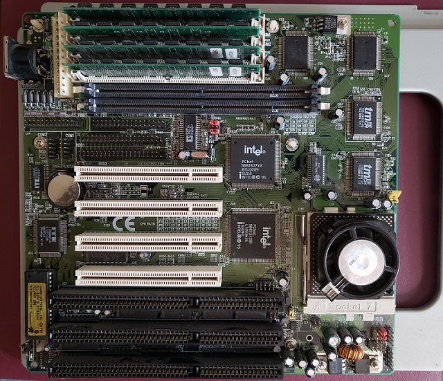<br>


### 64MB EDO DRAM
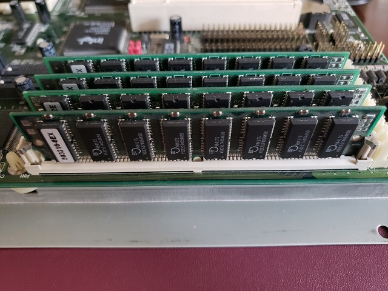

### Mitsumi D359M3 Internal 3.5" 1.44 MB Floppy Drive x 2
<br>


### Number Nine #9FX Motion 771 SVGA


### Dell:registered: U2412M 24 inch LCD monitor  Dell:registered: RT7D20 104-Key Standard US Layout Windows Keyboard  via PS/2 to 5-pin DIN adapter


### BIOS Boot with no Media - No Network Adapter
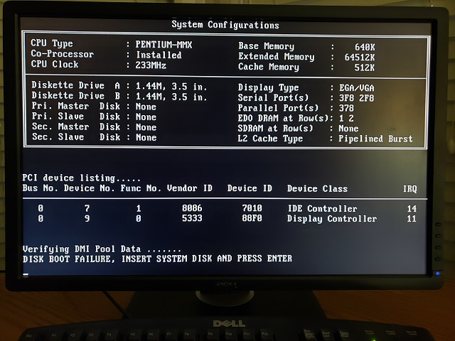

### Intel Pro/1000 MT Desktop Adapter
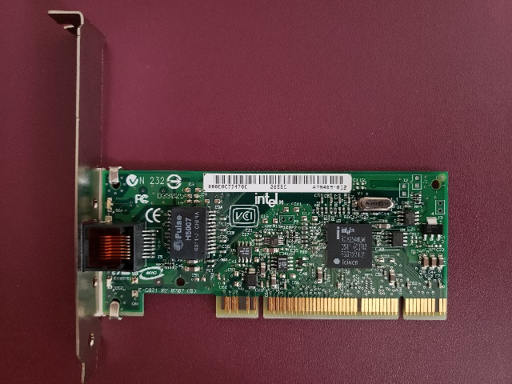

### BIOS Boot with no Media - With Network Adapter
- Note Intel:registered: Boot Agent searches for LAN boot.

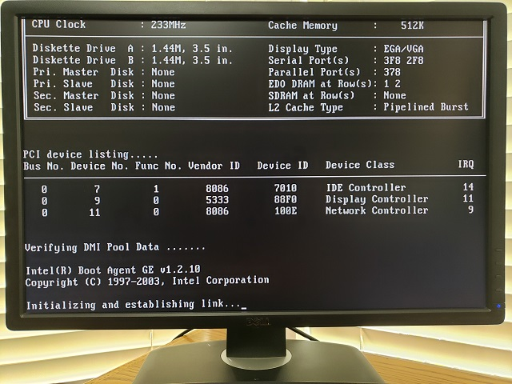

### Sabrent N533 External Floppy Disk Drive
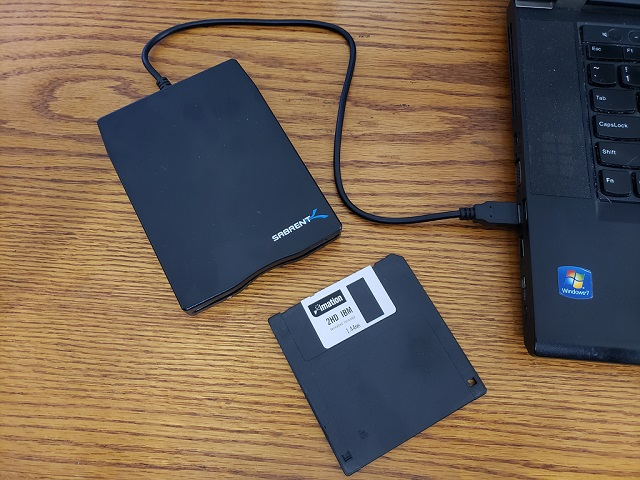

### Windows Explorer Floppy Disk Properties
- After connecting the external Floppy Disk Drive to the development system, right-click on Drive A: shown in Windows Explorer.
- The Floppy Disk Properties windows opens to confirm normal operation.

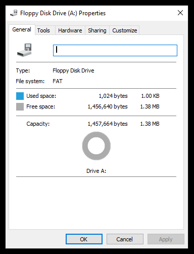

### HxD Hex Editor - About
- Start the HxD Hex Editor program as Administrator.

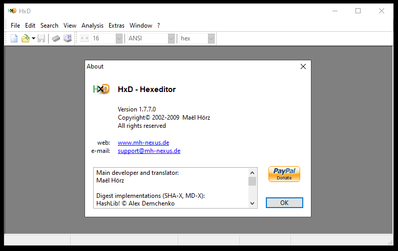

### HxD Hex Editor - Open Device
- Use the Extras|Open Disk ... menu option to open the "open disk" dialog.

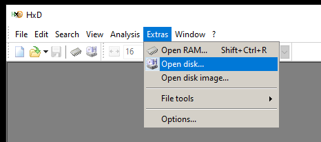

### HxD Hex Editor - Select Device
- In the "open disk" dialog, select floppy disk A:.
- IMPORTANT: Uncheck the "open as read only" checkbox.

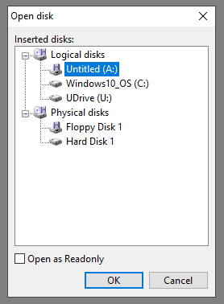

### HxD Hex Editor - Read/Write Warning
- When a disk is opened without read-only protection a warning is displayed.
- Click "OK" to continue.


### HxD Hex Editor - MS-DOS Boot Sector
- In this example, the diskette we have selected to update already as a DOS boot sector on it.
- We will overwrite this boot sector with the os.dat boot sector image.

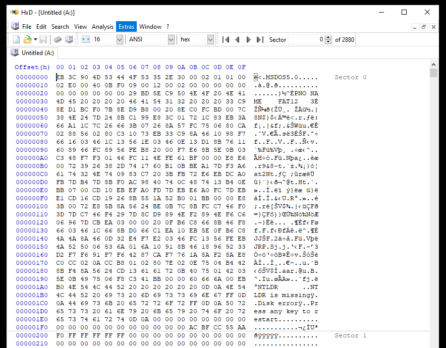

### HxD Hex Editor - File Open
- Use the File|Open menu option to open the os.dat file image.

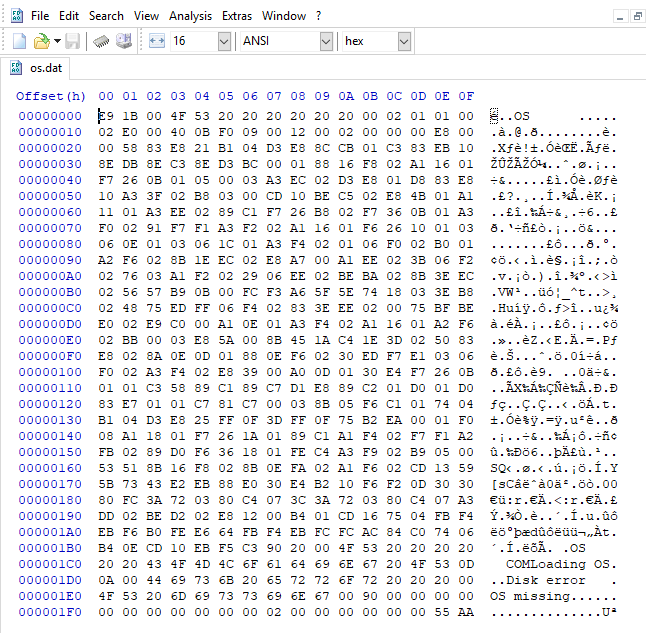

### HxD Hex Editor - Edit | Copy
- Use the Edit|Copy menu option to copy the selected os.dat boot sector.

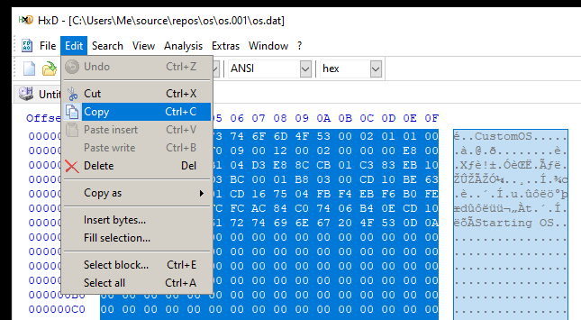

### HxD Hex Editor - Edit | Paste Write
- Use the Edit|Paste Write open to paste the copied os.dat sector into the floppy disk A: tab.

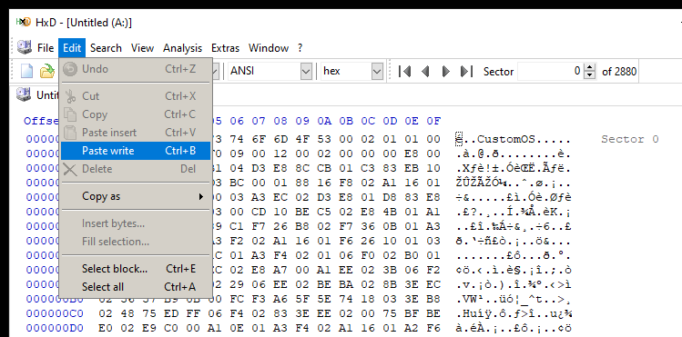

### HxD Hex Editor - OS Boot Sector Pasted
- The pasted boot sector appears in red where byte values have changed.
- Use the File|Save menu to save changes to the floppy disk.

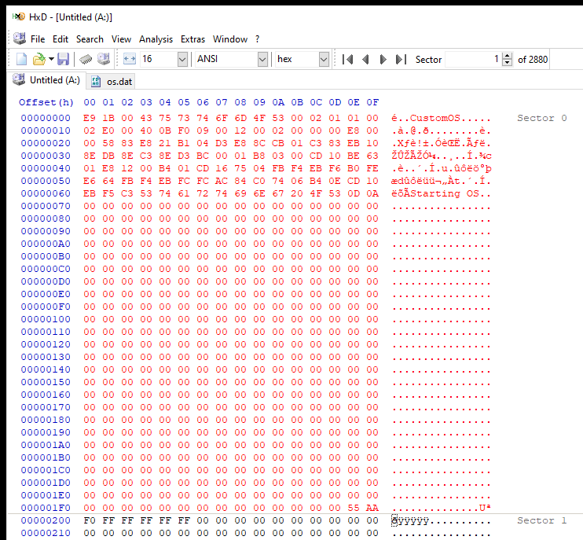

### HxD Hex Editor - Overwrite Warning
- HxD displays a warning dialog box before writing changes.
- Click "Yes" to confirm and save changes.


### HxD Hex Editor - Diskette Changes Saved
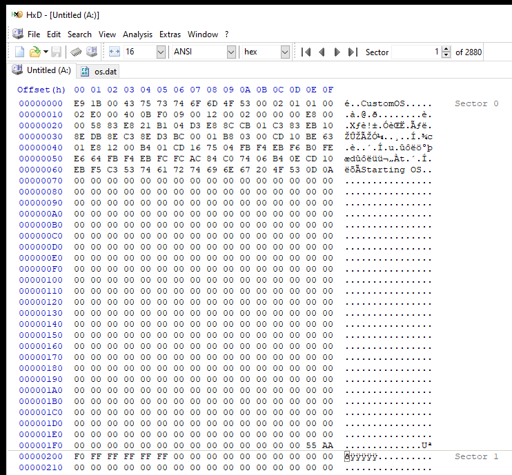

### Insert Diskette in Target Platform Floppy Disk Drive and Reboot
- Remove the floppy diskette from the external floppy drive.
- Insert floppy diskette into Drive A: on the target physical system.
- Start the target physical system.


### Using the ```osprep.com``` Program


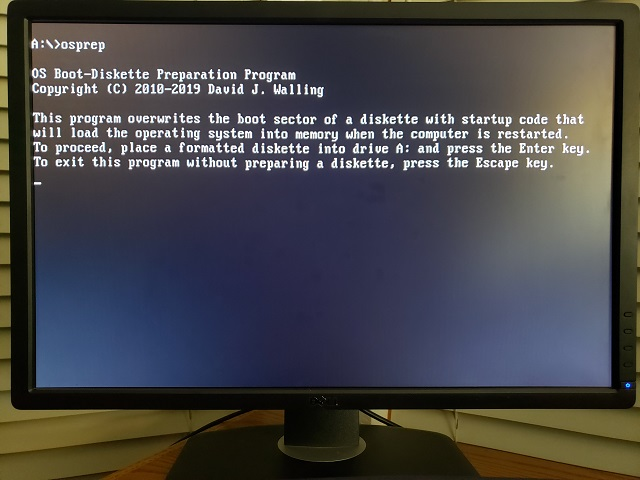


