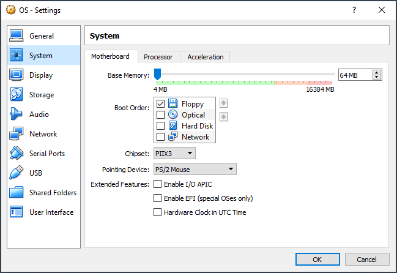
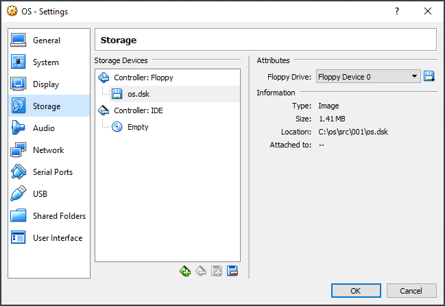
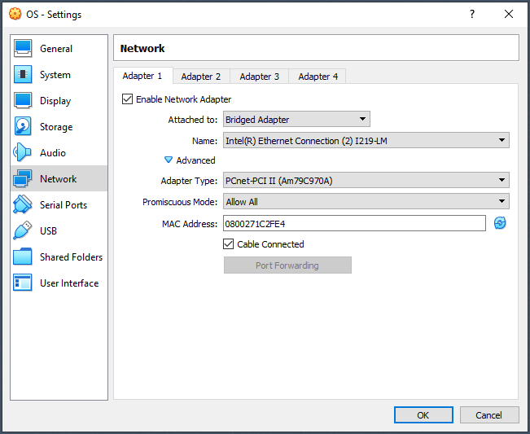
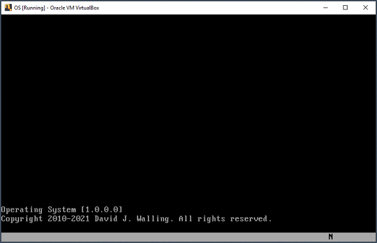
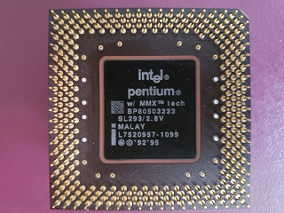
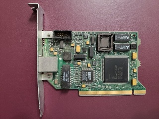
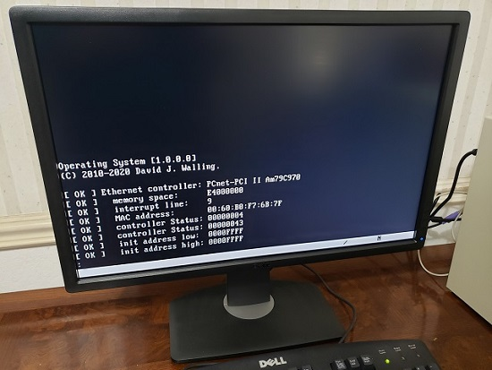

## Setup virtual and physical test environments. 

[Back](../README.md) to Tutorials  
[Next](../001/README.md) Create a simple boot sector.  

### Virtual Test Environment

The Operating System is demonstrated in a virtual environment using Oracle Virtual Box.

### Virtual Box VM Definition

|||
|---|---|
||Base memory is set to 64MB to simulate the physical environment. Select only the Floppy Disk as the Boot Order.|
||Add a Type I82078 Floppy Disk controller. Add a disk and select the `os.dsk` for the tutorial project under test.|
||Enable the network adapter. Select an appropriate interface. Select the PCnet-PCI II (Am79C970A) adapter type.|
|||

### Virtual Box VM Operation

|||
|---|---|
||Start the Virtual Machine.|
|||

### Physical Test Environment
  
The components of the physical test environment are listed below.  

||||
|---|---|---|
||The processor is an Intel Pentium MMX 233MHz. The motherboard is an Intel 555A Rev 3.2.||
||The memory is 64MB of EDO DRAM. The display adapter is a Number Nine 9FX Motion 771 VGA.||
||The diskette drive is a Mitsumi D359 M3. The network adapter is an Advanced Micro Devices PCInet PCI Fast AM79C971.||||The display monitor is a Dell U2412M. The keyboard is a Dell RT7D20.||
||||

Preparing the boot diskette on the development laptop uses the external diskette drive shown below.  
  
|||
|---|---|
||The development environment external diskette drive is a Sabrent N533. The diskettes are high-density 3.5" 1.44MB.|
|||

### Physical Environment Operation

|||
|---|---|
||Insert the boot diskette into drive A:. Start the test system.|
|||

[Back](../README.md) Tutorials  
[Next](../001/README.md) Create a simple boot sector.    